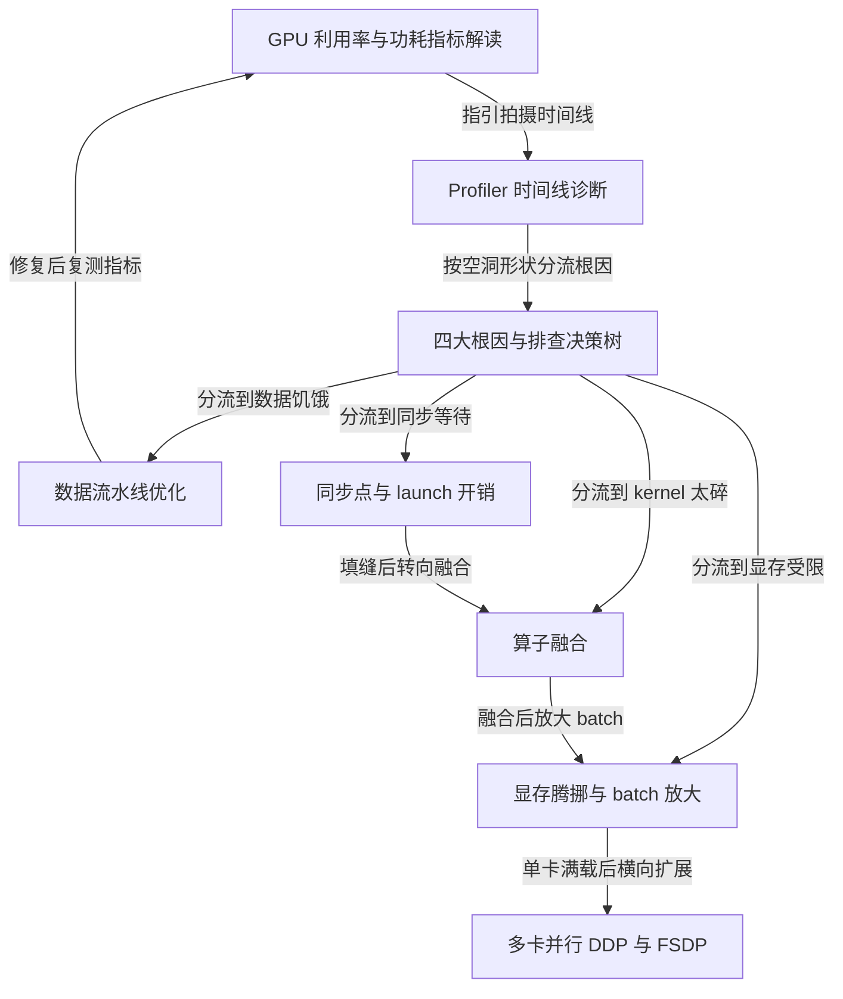

本项目旨在解决训练深度学习模型时 **GPU 利用率偏低**（俗称"GPU 占不满"）的问题。
它从看懂 *GPU-Util 与功耗指标* 入手，借助 **Profiler 时间线** 定位病灶，
将 GPU 空闲归因为四大根因：**数据饥饿**、*同步点与 launch 开销*、**kernel 太碎**、**显存受限**。
针对每种根因给出具体药方：优化 *数据流水线*、降低同步、做 **算子融合**、
腾挪显存放大 batch，最后再考虑 **多卡 DDP/FSDP** 横向扩展。
整体遵循"先测量、再定位、单变量修复、改完复测"的方法论，目标是**用更少时间完成同样的训练**。

<!-- more -->

## Chapters

1. [GPU 利用率与功耗指标解读](/blog/posts/gpu-util-01-metrics/)
2. [Profiler 时间线诊断](/blog/posts/gpu-util-02-profiler/)
3. [四大根因与排查决策树](/blog/posts/gpu-util-03-decision-tree/)
4. [数据流水线优化](/blog/posts/gpu-util-04-data-pipeline/)
5. [同步点与 launch 开销](/blog/posts/gpu-util-05-sync-launch/)
6. [算子融合](/blog/posts/gpu-util-06-kernel-fusion/)
7. [显存腾挪与 batch 放大](/blog/posts/gpu-util-07-memory-batch/)
8. [多卡并行 DDP 与 FSDP](/blog/posts/gpu-util-08-ddp-fsdp/)

---

Generated by [AI Codebase Knowledge Builder](https://github.com/The-Pocket/Tutorial-Codebase-Knowledge)