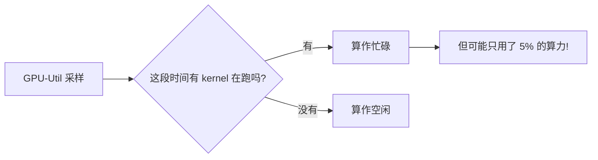
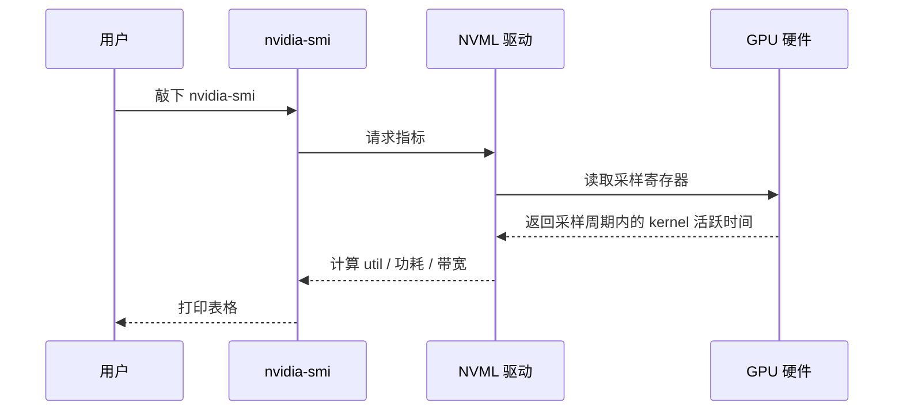
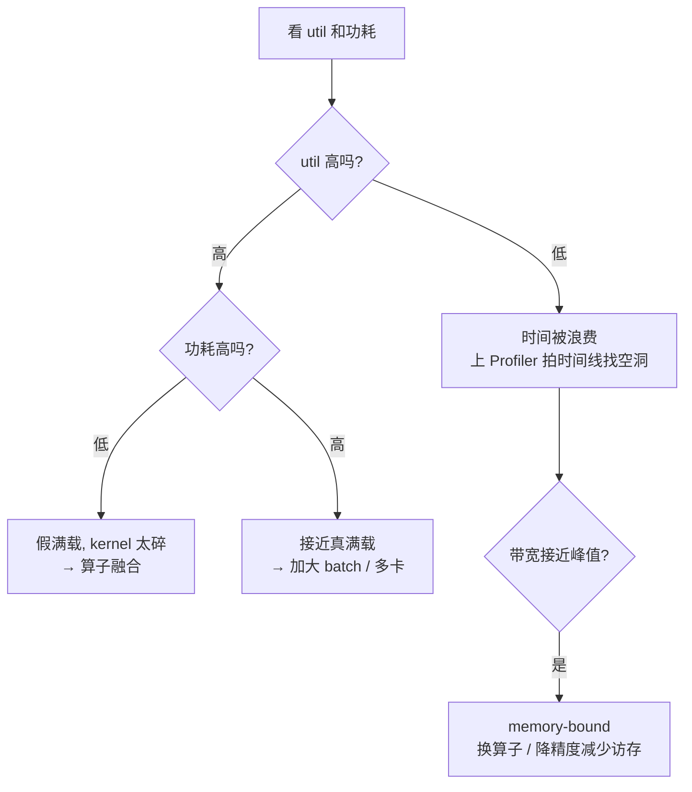

欢迎来到本系列教程!如果你正在读这篇文章,大概率是因为你遇到了一个让人抓狂的问题:

<!-- more -->

> "我明明买了一张 RTX 3090,为什么训练的时候 `nvidia-smi` 里 GPU-Util 只有 30%~40%?钱花出去了,卡却在摸鱼!"

别急,这个问题非常普遍,而且**几乎一定能修**。但在动手之前,我们必须先学会"看懂仪表盘"。就像医生看病要先量体温、测血压一样,我们要先搞清楚 GPU 到底在干什么。

本章的目标只有一个:**让你不再误读 GPU-Util 和功耗这两个数字**。

---

## 1.1 先看一个真实的"病例"

本系列教程会一直围绕一个贯穿案例展开:用单张 RTX 3090(24GB 显存)微调一个约 10 亿参数的语言模型,序列长度 512。初始的训练循环大概长这样(别怕,后面章节会逐行拆解):

```python
loader = DataLoader(ds, batch_size=16, num_workers=0)  # 病灶: 单进程读数据
for step, batch in enumerate(loader):
    x, y = batch["input_ids"], batch["labels"]
    loss = model(x, labels=y).loss          # 病灶: 未融合的小 kernel
    loss.backward()
    opt.step(); opt.zero_grad()
    print(step, loss.item())                # 病灶: 每步强制同步
```

跑起来之后,打开另一个终端敲 `nvidia-smi`,你会看到这样一组数字:

| 指标 | 数值 |
|------|------|
| GPU-Util | 约 35% 波动 |
| 功耗 | 70-90W(额定 350W) |
| 显存 | 9GB / 24GB |
| 温度 | 35°C |

**症状很明显:卡很闲,而且很凉快。** 但"闲"和"凉快"到底意味着什么?我们得先学会解读这些数字。

---

## 1.2 GPU-Util 到底是什么?(90% 的人会误读)

### 它的官方定义

NVIDIA 的 NVML 库对 GPU-Util 的定义是:

> **采样周期内,至少有一个 kernel 在 GPU 上执行的时间占比。**

注意关键词:**时间占比**。它只回答一个问题——"这段时间里,GPU 有没有在干活?" 它**不回答**"干得有多猛"。

### 一个工厂的类比

想象一个工厂车间,里面有一台巨大的机器:

- 只要机器的**皮带在转**,系统就认为它"在工作"。
- 但皮带转一圈,可能只拧了一颗螺丝,也可能组装了一整台汽车。

GPU-Util 就是那个"皮带有没有在转"的传感器。它只告诉你**时间维度上的忙闲度**,而不是**计算强度**。



### 两个方向的误读,都要避免

**误读 A:** "util 30% = 只用了 30% 的算力。"
❌ 错。它只说明 **30% 的时间**有 kernel 在跑,跟算力利用率没关系。

**误读 B:** "util 90% = 满载,没救了。"
❌ 错。可能每个 kernel 只占用了 5% 的 SM(流多处理器),kernel 之间衔接得很紧密,但都很"轻"——这就是所谓的**假满载**。

### 一句话记住

> **util 低 = 时间被浪费了,一定有救;util 高 ≠ 没救,得结合功耗判断真实强度。**

---

## 1.3 功耗:最诚实的干活强度指标

如果说 util 是"皮带有没有转",那**功耗就是"机器到底出了多少力"**。功耗几乎不会撒谎。

- RTX 3090 的 TDP(热设计功耗)是 **350W**。
- 让它跑一个纯的大矩阵乘法(GEMM),功耗轻松冲到 **300W+**。
- 如果它停在 **90W**,哪怕 util 显示 100%,那也只是"轻负载地忙着"——就像一个人一边跑步一边刷手机,看起来很忙,其实没出多少力。

### 一个"真满载"参照系

要判断自己的训练算不算"真满载",最好的办法是先跑一个微基准,把卡拉满,记下此时的 util 和功耗:

```python
import torch
a = torch.randn(8192, 8192, device="cuda", dtype=torch.bfloat16)
b = torch.randn(8192, 8192, device="cuda", dtype=torch.bfloat16)
for _ in range(50):     # 同时开另一个终端看 nvidia-smi
    c = a @ b
torch.cuda.synchronize()
```

运行这段代码时,在另一个终端敲 `nvidia-smi dmon`,你会看到功耗飙到 300W 以上、util 接近 100%。**这就是你这张卡的"真满载"参照系**。以后训练时对照它,就知道自己离满载还有多远。

---

## 1.4 必须一起看的"伴随指标"

单看 util 会骗人,所以我们要凑齐一桌"仪表盘"。推荐用 `nvidia-smi dmon` 或更友好的 `nvitop`:

| 指标 | 含义 | 怎么判断 |
|------|------|---------|
| sm/util | kernel 执行时间占比 | >90% 为佳 |
| pwr 功耗 | 实际功耗 / TDP | 最诚实的强度指标,>70% TDP 算重载 |
| 内存带宽 | 显存读写 / 峰值 | 高带宽 + 低功率 = memory-bound(访存受限) |
| 显存占用 | 已分配显存 | 留出加大 batch 的余量 |

**核心心法:功耗最难撒谎。** 只要功耗上不去,不管 util 多高,都说明算力没打满。

---

## 1.5 Occupancy:SM 的"上座率"

GPU 内部由很多个 **SM(Streaming Multiprocessor,流多处理器)**组成,你可以把它们想象成一排排的"工位"。

- **util** 是**时间维度**:工位上有没有人在干活?
- **occupancy** 是**空间维度**:干活的时候,工位上坐了多少人?

```
util 高 + occupancy 低  →  少数工位在疯狂加班,大部分工位空着
util 低 + occupancy 低  →  大家都不太忙,时间被浪费
```

线程少、块小的 kernel(比如逐元素的 Python 循环、batch=2 的小张量)天然就是低 occupancy。occupancy 需要专业工具 **Nsight Compute(ncu)** 才能精确查看,但日常排查时你只要记住一个直觉就够了:

> **碎 kernel → 合并 / 融合。**

---

## 1.6 内部机制:一次采样发生了什么?

当你敲下 `nvidia-smi` 或 `nvidia-smi dmon` 时,背后大致经历了这样的流程:



关键点在于:**采样是离散的**。默认采样周期通常是几百毫秒到一秒。如果 kernel 非常碎(比如每个只跑几十微秒),采样可能会"漏看"一些空隙,让 util 看起来比实际高。这也是为什么我们**不能只信 util**,必须结合功耗一起看。

---

## 1.7 用判断矩阵解决你的问题

现在我们把所有指标整合成一张"决策矩阵"。这是本章最重要的东西,建议截图保存:



对照我们贯穿案例的初始状态:

- **util 35%(低)+ 功耗 90W(低)** → 落在矩阵的 **C 分支:时间被浪费**。
- 结论:**有救!** 下一步就是上 Profiler 拍时间线,找出 GPU 到底在等什么。

---

## 1.8 本章小结

恭喜你,现在你已经能正确解读 GPU 的"体检报告"了。回顾一下重点:

1. **GPU-Util 是时间维度的忙闲度**,不是算力百分比。低 = 时间被浪费(有救),高 ≠ 满载。
2. **功耗是最诚实的干活强度指标**。3090 跑满应该到 300W+,停在 90W 就是轻负载。
3. **必须把 util、功耗、显存带宽、occupancy 一起看**,才能判断是"时间被浪费"还是"假满载"。
4. **用微基准建立真满载参照系**,用判断矩阵快速定位问题方向。
5. 我们的案例已经定位到"时间被浪费",下一步就是找出时间去哪了。

那么,GPU 到底在等什么?是等数据?等 CPU?还是被同步点卡住?光看 `nvidia-smi` 是看不出来的,我们需要一台"慢动作摄像机"。

下一章,我们将学习如何使用 Profiler 拍出 GPU 的时间线,亲眼看到那些让 GPU 空等的"空洞"。

➡️ [第 2 章: Profiler 时间线诊断](/blog/posts/gpu-util-02-profiler/)

---

Generated by [AI Codebase Knowledge Builder](https://github.com/The-Pocket/Tutorial-Codebase-Knowledge)