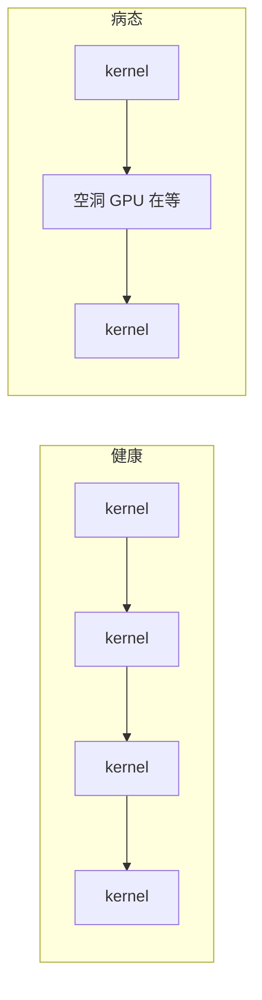
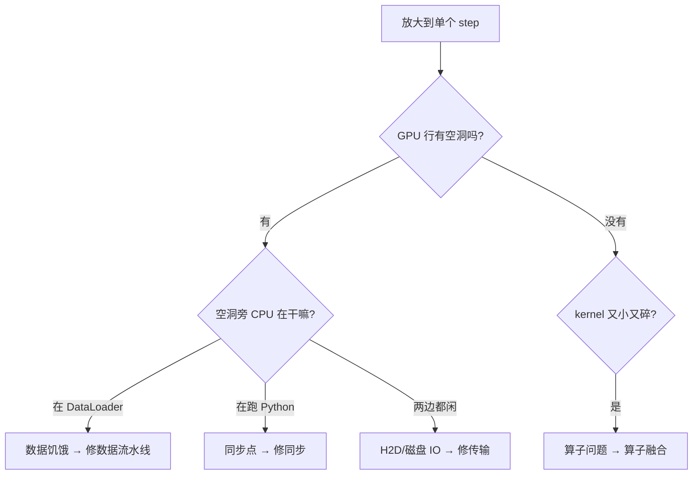

在[第 1 章](/blog/posts/gpu-util-01-metrics/)里,我们学会了看仪表盘:`nvidia-smi` 告诉我们 GPU-Util 只有 35%、功耗只有 90W。我们由此确诊了一件事——**卡在摸鱼,时间被浪费了**。

<!-- more -->

但仪表盘只能告诉你"生病了",不能告诉你"病在哪"。就像你发烧到 39 度,体温计只能告诉你发烧,却不知道是嗓子发炎还是肠胃感冒。

那 65% 被浪费掉的时间里,GPU 到底在等什么?是等数据?等 CPU 跑 Python?还是被某个同步点卡住了?**光看 `nvidia-smi` 是看不出来的。**

这一章,我们要给训练过程拍一张"CT 扫描"——**Profiler 时间线**。拍完之后,你会亲眼看到 GPU 空等的那些"空洞",并且一眼认出凶手是谁。

---

## 2.1 先讲个类比:工厂监控录像

回忆第 1 章那个工厂的比喻:GPU 是一台大机器,`nvidia-smi` 是"皮带转没转"的传感器。

现在问题来了:传感器告诉你"这台机器今天有 65% 的时间皮带是停的"。你想知道为什么停,该怎么办?

**去看监控录像。**

录像里,你会看到一条时间轴,上面同时画着好几条"跑道":
- 一条是**机器(GPU)的跑道**:它什么时候在转,什么时候停着。
- 一条是**送料工(CPU)的跑道**:他什么时候在搬原料,什么时候在发呆。

把这两条跑道对起来看,凶手立刻现形:

- 机器停了,而送料工正在**满头大汗地搬原料** → 机器在**等料**(数据饥饿)。
- 机器停了,而送料工在**打电话闲聊**(跑 Python) → 机器在**等指令**(同步点)。
- 机器停了,送料工也闲着 → **原料堵在路上**(磁盘 IO / H2D 拷贝)。

Profiler 时间线,就是这份监控录像。

---

## 2.2 怎么"拍片":三行核心代码

拍片非常简单,用 PyTorch 自带的 `torch.profiler` 就行。但有一个关键技巧:**只拍中间几个 step**。

为什么?因为训练刚开始时,GPU 要做一堆预热工作(编译 kernel、分配缓存、加载数据),那几帧是失真的。就像你拍电影,不会把演员上台前化妆的过程也拍进去。

```python
from torch.profiler import profile, ProfilerActivity

with profile(activities=[ProfilerActivity.CPU, ProfilerActivity.CUDA]) as prof:
    for step, batch in enumerate(loader):
        if step == 20: break          # 只拍 20 步, 跳过预热
        # ... 正常的训练一步 ...
```

逐行解释:

- `activities=[...CPU, ...CUDA]`:我们**同时**记录 CPU 和 GPU 两条跑道,这样才能对照着看。
- `if step == 20: break`:拍 20 步就够,太多了文件会很大,分析起来也累。
- 中间省略的,就是你平时训练循环里那几行(取数据、forward、backward、step)。

拍完之后,把结果导出成一个文件:

```python
prof.export_chrome_trace("trace.json")
```

这个 `trace.json` 就是"录像文件"。用浏览器打开 **`chrome://tracing`**(Chrome 自带)或者更现代的 **`https://ui.perfetto.dev`**(推荐,界面更清爽),把文件拖进去,你就能看到时间线了。

---

## 2.3 怎么"读片":认识时间线的样子

打开 Perfetto,你会看到一张图。别慌,我们先认识它的坐标:

- **横轴是时间**:从左到右,一秒一秒往前走。
- **纵轴是跑道**:每一行代表一个执行单元。你会看到几行 `CPU`(主线程、DataLoader 线程)和一行 `GPU`。

**健康的时间线长这样**:GPU 那一行,一个个 kernel 像火车车厢一样,**一个紧挨着一个,排得满满当当**。这说明 GPU 一刻没停。

**生病的时间线长这样**:GPU 那一行,车厢之间出现了**空隙**——我们叫它"**空洞**"。空洞就是 GPU 在干等的时间。



**诊断的核心动作只有一个**:放大到**单个 step** 的粒度,盯着那些空洞,然后问一句:

> **"空洞发生的这段时间,CPU 那几行在干什么?"**

答案只有三种可能,对应三种病。

---

## 2.4 三种空洞形状 = 三种病

这是本章最重要的部分,建议截图保存。

### 形状一:空洞旁,CPU 在 DataLoader 里忙

你看到 GPU 空着,而 CPU 的 `DataLoader` 线程正在疯狂地跑 `collate`、读文件、做预处理。

**诊断:数据饥饿。** GPU 饿了,等数据喂它。

**修法方向**:优化数据流水线(`num_workers`、`pin_memory`、预取)。详见[第 4 章](/blog/posts/gpu-util-04-data-pipeline/)。

### 形状二:空洞旁,CPU 在跑 Python

你看到 GPU 空着,而 CPU 主线程正在跑一段 Python 代码——比如 `loss.item()`、`print()`、或者一个慢吞吞的 Python `for` 循环。

**诊断:同步点。** CPU 和 GPU 之间有一个"必须等对方"的卡点,GPU 被迫停下等 CPU。

**修法方向**:去掉每步的 `.item()`/`print()`,把指标累积到 GPU 上,低频再取回。详见[第 5 章](/blog/posts/gpu-util-05-sync-launch/)。

### 形状三:空洞旁,两边都闲着

你看到 GPU 空着,CPU 也没在干正事——两边都在发呆。

**诊断:H2D 拷贝 / 磁盘 IO。** 数据正在从主机内存搬到显存(H2D),或者卡在磁盘上读不出来。这段时间谁都没法干活。

**修法方向**:修传输方式(`pin_memory`)或存储格式(合并小文件、离线预处理)。

### 如果没有空洞,但 kernel 又小又碎呢?

还有一种情况:GPU 那一行**没有空洞**,车厢排得满满的,但每一节车厢都**又小又短**,密密麻麻像蚂蚁。

**诊断:算子问题。** GPU 一直在忙,但忙的都是小活儿,频繁启动 kernel 的开销比干活本身还大——这就是第 1 章说的"假满载"。

**修法方向**:算子融合(`torch.compile`、CUDA Graph)。详见[第 6 章](/blog/posts/gpu-util-06-kernel-fusion/)。

---

## 2.5 用一张决策图记住读片流程

把上面所有内容压缩成一张图,以后每次读片照着走:



**心法一句话:先看有没有空洞,有空洞看 CPU 在干嘛,没空洞看 kernel 碎不碎。**

---

## 2.6 拿贯穿案例来实战

回到我们那个"10 亿参数模型微调"的案例。拍完片、放大到单个 step,你会看到这样一个约 **285 毫秒**的 step:

| 阶段 | 耗时 | 时间线表现 |
|------|------|-----------|
| 取数据 | 180ms | GPU 空洞①,CPU 在 DataLoader 忙 |
| H2D 拷贝 | 2ms | 短暂传输 |
| forward | 35ms | GPU 在跑 |
| `loss.item()` | 等待 | GPU 空洞②,CPU 在等同步 |
| backward | 40ms | GPU 在跑 |
| `print` | — | GPU 空洞③,CPU 在跑 Python |

**算一笔账**:GPU 真正干活的时间 ≈ 35 + 40 = **80ms**。整个 step 是 285ms。

$$\text{util} \approx \frac{80}{285} \approx 28\%$$

这和我们在第 1 章仪表盘上看到的 35% **基本吻合**!这说明我们的读片是准的。

> **一个超好用的交叉验证技巧**:`util ≈ GPU 干活时间 / step 总时长`。如果你从时间线算出来的 util 和 `nvidia-smi` 看到的对得上,说明你读片读对了。

从这张片子,我们一眼就看出:**三个空洞,三种病全齐了**——数据饥饿、同步点、外加 Python 开销。这就是为什么这个案例的 GPU 利用率那么惨。后面的章节会逐个击破。

---

## 2.7 换个视角:算子级表格

时间线是"横向"看——看时间怎么被切碎。有时候我们还想"纵向"看——**哪个算子最耗时间?**

Profiler 还能给你一张排名表:

```python
print(prof.key_averages().table(sort_by="cuda_time_total"))
```

运行后,你会得到一张按 GPU 耗时排序的算子列表,像这样(示意):

```
Name                  Self CUDA Time
aten::linear          45.2ms
aten::layer_norm      12.8ms
aten::gelu             8.1ms
...
```

这张表回答的是"**哪个算子最贵**",帮你在做算子融合时,优先盯住排名靠前的大头。

- **时间线**回答:"时间被谁偷走了?"(横向)
- **算子表**回答:"哪个算子最费时?"(纵向)

两个视角配合使用,诊断就完整了。

---

## 2.8 什么时候需要更深的工具?

如果你已经排除了数据饥饿、同步点、H2D 传输,GPU 也没空洞了,但功耗还是上不去,那问题就深入到了**单个 kernel 内部**——是卡在算力上,还是卡在显存带宽上?

这时候需要请出更专业的工具:**Nsight Compute(`ncu`)**。它能告诉你单个 kernel 的 SM 利用率、内存吞吐等细节。

不过对于日常的"GPU 占不满"排查,**Profiler 时间线已经足够用了**。别一上来就掏大炮打蚊子——先把时间线读明白,90% 的问题就现形了。

---

## 2.9 两个必须记住的注意事项

1. **Profiler 本身有开销。** 开着 Profiler 跑训练会变慢,所以它**只用于诊断**,不要在正式计时的跑批里开着它。诊断完就关掉。
2. **每次修复后,重新拍片对比。** 优化不量化等于没优化。改一处代码,就重新拍一次片,看空洞是不是变小了、消失了。

---

## 2.10 本章小结

恭喜!现在你已经掌握了"CT 扫描"这门手艺。回顾一下重点:

1. **Profiler 时间线是诊断的核心工具**,它把 CPU 和 GPU 的"监控录像"同时画出来。
2. **拍片只拍中间几个 step**,跳过预热,否则数据失真。
3. **读片的核心是找空洞**,然后看空洞旁 CPU 在干嘛:
   - CPU 在 DataLoader → 数据饥饿
   - CPU 在跑 Python → 同步点
   - 两边都闲 → H2D/磁盘 IO
   - 没空洞但 kernel 碎 → 算子问题
4. **用 `util ≈ GPU 干活时间 / step 总时长` 交叉验证**,确保读片读对了。
5. **算子级表格是纵向视角**,帮你找到最贵的算子。
6. **先测量,再动手**;改完必复测。

现在,我们已经能精准地"看到"病灶了。但面对四种病,到底该先修哪个?有没有一套通用的排查顺序?

下一章,我们把这一章的诊断方法,升级成一张完整的**排查决策树**——从"util 低"出发,一步一步走到最终的修复方案。

➡️ [第 3 章: 四大根因与排查决策树](/blog/posts/gpu-util-03-decision-tree/)

---

Generated by [AI Codebase Knowledge Builder](https://github.com/The-Pocket/Tutorial-Codebase-Knowledge)