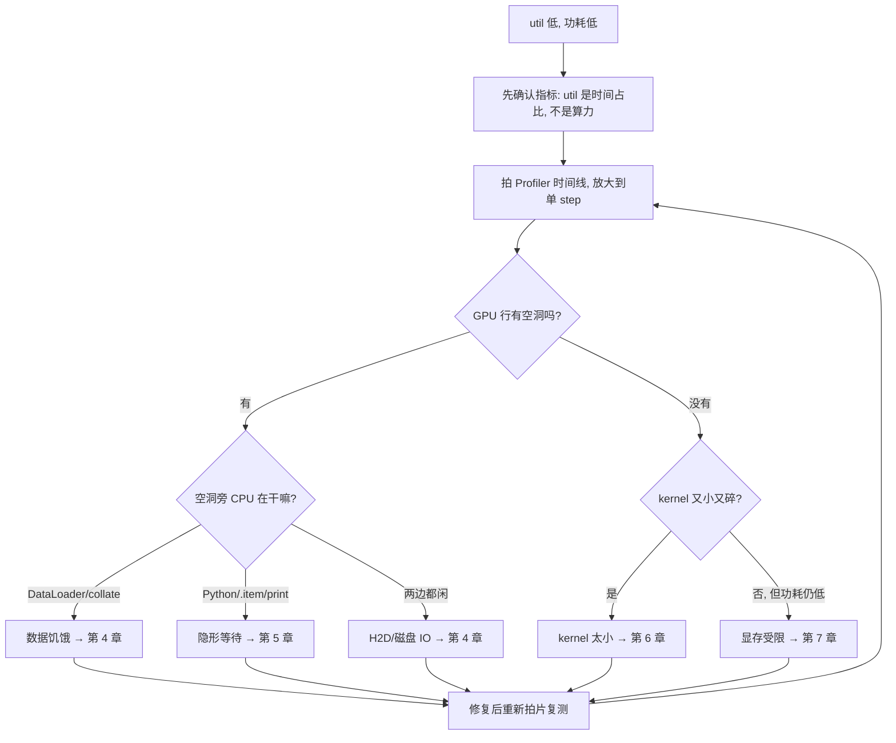
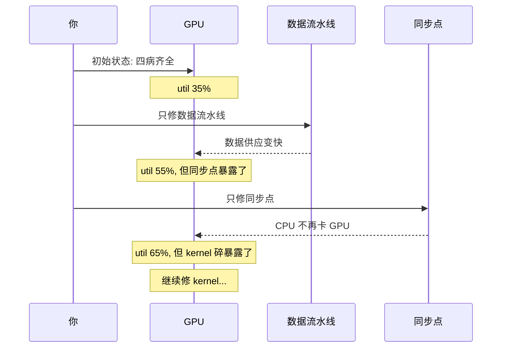

在[第 2 章](/blog/posts/gpu-util-02-profiler/)里,我们学会了用 Profiler 给训练过程拍"CT 扫描"。你现在已经能放大到单个 step,盯着时间线上那些 GPU 空等的"空洞",并且一眼认出凶手是谁。

<!-- more -->

但是,当你真正坐下来面对一个 util 35% 的训练脚本时,新的困惑来了:

> "我知道有空洞,也知道空洞旁 CPU 在忙。可**到底该先修哪个**?修完一个,又该看哪里?"

这就像你手里拿着一份体检报告,上面有七八个指标都标着"异常"。你不能一口气全治,得有个**优先级**和**排查顺序**。

这一章,我们要把上一章的"读片方法"升级成一张**完整的作战地图**——从"util 低"这个起点出发,一步一步走到最终的修复方案。这张地图,就是我们贯穿全系列的**排查决策树**。

---

## 3.1 先认识"四大根因"

回忆第 2 章我们诊断出的三种空洞形状,再加上一种"没有空洞但 kernel 很碎"的情况,GPU 空闲的原因其实可以归纳为**四大根因**:

| 根因 | 一句话解释 | 时间线特征 |
|------|-----------|-----------|
| **数据饥饿** | GPU 饿了,等数据喂它 | 空洞旁 CPU 在 DataLoader 忙 |
| **隐形等待** | CPU 和 GPU 频繁握手,GPU 被迫停下等 | 空洞旁 CPU 在跑 Python |
| **kernel 太小** | 单个任务喂不饱 GPU,算力没打满 | 无空洞,但 kernel 又小又碎 |
| **显存受限** | batch 上不去,任务规模被显存卡死 | 显存占满,功耗上不去 |

用工厂的比喻再讲一遍:

- **数据饥饿** = 机器停了,送料工在满头大汗搬原料,但料来得太慢。
- **隐形等待** = 机器停了,因为工头每拧一颗螺丝就要打电话汇报一次。
- **kernel 太小** = 机器一直在转,但每次只拧一颗螺丝,大材小用。
- **显存受限** = 车间太小,一次只能放一点点原料,机器永远吃不饱。

### 关键提醒:四大根因会"叠加"和"互相掩盖"

这是新手最容易踩的坑。四种病**不是互斥的**,它们常常同时存在,而且**修好一个,才会露出下一个**。

想象一下:你有一个装满水的杯子,里面有四层沙子,一层比一层细。你把最粗的一层过滤掉,水还是流得慢——因为下面还有更细的沙子堵着。

我们的贯穿案例就是这样:**四病齐全**。数据饥饿、同步点、碎 kernel、小 batch,全都在。修好数据流水线,util 从 35% 涨到 55%,然后你才发现——原来还有同步点在等着你。

所以排查必须**一次只改一个变量,改完复测**,否则你永远不知道到底是哪一步起了作用。

---

## 3.2 排查决策树:从"util 低"出发

现在我们把整个排查流程画成一张**决策树**。这是本章的核心,建议截图保存,以后每次遇到问题就照着走。



看懂这张图,你就掌握了整个系列的**主线**。我们来逐步拆解。

### 第一步:先确认指标本身

别急着改代码。先问自己:**我看到的 util 低,是真的低吗?**

回忆第 1 章:util 是**时间占比**,不是算力百分比。如果功耗也很低(比如 90W),那才是真的闲。如果功耗已经 250W+,那 util 低可能只是采样误差。

**动作**:跑一次 `nvidia-smi dmon`,确认 util 和功耗都低,再往下走。

### 第二步:拍时间线

这是第 2 章的核心技能。用 `torch.profiler` 拍中间几个 step,导出 `trace.json`,在 Perfetto 里打开。

**动作**:拍片,放大到单个 step。

### 第三步:按空洞形状分流

这是决策树的**分叉口**。看 GPU 那一行:

- **有空洞** → 看空洞旁 CPU 在干嘛,分流到数据饥饿 / 隐形等待 / H2D。
- **没有空洞,但 kernel 碎** → 分流到 kernel 太小。
- **没有空洞,kernel 也不碎,但功耗上不去** → 分流到显存受限。

### 第四步:逐个修复并复测

修完一处,**重新拍片**,回到第三步。循环直到 util 和功耗同时贴上限。

---

## 3.3 用一个真实案例走一遍决策树

我们拿贯穿案例(单张 RTX 3090 微调 10 亿参数模型)来完整走一遍。

### 起点:util 35%,功耗 90W

```python
loader = DataLoader(ds, batch_size=16, num_workers=0)  # 病灶①: 单进程读数据
for step, batch in enumerate(loader):
    x, y = batch["input_ids"], batch["labels"]
    loss = model(x, labels=y).loss          # 病灶②: 未融合的小 kernel
    loss.backward()
    opt.step(); opt.zero_grad()
    print(step, loss.item())                # 病灶③: 每步强制同步
```

### 走决策树

**第一站**:确认指标。util 35%,功耗 90W(额定 350W)。**真的低**,继续。

**第二站**:拍片。放大到单个 step,看到 285ms 的 step 里有三个空洞。

**第三站**:分流。

- 空洞①旁 CPU 在 `collate` → **数据饥饿**。
- 空洞②旁 CPU 在等 `.item()` → **隐形等待**。
- 空洞③旁 CPU 在跑 `print` → **隐形等待**。
- 修完前两个后,kernel 又小又碎 → **kernel 太小**。
- 最后发现 batch 加不上去 → **显存受限**。

**第四站**:按顺序修。**一次只改一个**。

### 修复里程碑

这张表就是决策树走完的"成绩单":

| 阶段 | GPU-Util | 功耗 | 显存 | 剩余症结 |
|------|---------|------|------|---------|
| 初始 | ~35% | 90W | 9GB | 四病齐全 |
| 修完数据流水线 | ~55% | 150W | 9GB | CPU 同步等待 |
| 修完同步+图捕获 | ~65% | 200W | 9GB | kernel 太碎 |
| 修完算子融合 | ~75% | 260W | 9GB | batch 偏小 |
| 修完显存+加大 batch | ~92% | 320W | 22GB | 接近满载 |

**注意每一步只动了一个变量**。这就是决策树的威力:它不是让你一次解决所有问题,而是让你**有序地、可验证地**一步步逼近满载。

---

## 3.4 十条军规:决策树背后的心法

决策树是"怎么做",军规是"为什么这么做"。这十条是无数人踩坑总结出来的经验,建议背下来:

1. **先 profile 再动手,改完必复测。** 不测量就优化,等于闭眼开车。
2. **util 低一定有救;util 高未必健康,看功耗。** 功耗是最诚实的指标。
3. **`num_workers` 四件套是性价比之王。** 大多数数据饥饿,改几行配置就解决。
4. **不要每 step `print(loss.item())`。** 这是新手最常见的同步点。
5. **单进程 for 循环多卡是反模式,用 `torchrun`。** 多卡要用 DDP。
6. **向量化干掉 Python 逐元素循环。** Python 循环是性能杀手。
7. **bf16 AMP 几乎无代价,先开。** 省显存、提速,一举两得。
8. **梯度累积省显存但不提速。** 别指望它提升吞吐。
9. **验收看时间线空洞,不看参数表。** 空洞变小才是真优化。
10. **优化目标是用更少时间完成同样的训练,不是好看的 util 数字。** 别本末倒置。

我特别想强调第 1 条和第 9 条。新手最容易犯的错,就是**凭感觉改代码**,改完也不复测,以为"应该快了"。结果跑了一周,util 还是 35%。

**正确的循环是:测量 → 定位 → 单变量修复 → 复测,循环直到功耗和 util 同时贴上限。**

---

## 3.5 内部机制:为什么"单变量修复"如此重要?

你可能会想:"我一次改三处,不是更快吗?"

答案是:**不行**。原因在于四大根因会**互相掩盖**。

用一张时序图说明这个"掩盖"过程:



看到关键了吗?**每次只修一个,才能"看到"下一个病**。如果你一次全改,util 涨到 92%,你根本不知道是哪一步起了作用,也不知道下次遇到类似问题该从哪下手。

这就是**科学实验的精神**:控制变量,一次一个。

---

## 3.6 用代码验证决策树:一个最小化的复测脚本

理论讲完了,我们来写一段**复测脚本**。每次改完代码,跑一遍它,就能量化"这次修复值不值"。

```python
import time, torch

def benchmark(model, loader, steps=30):
    torch.cuda.synchronize()
    t0 = time.time()
    for i, batch in enumerate(loader):
        if i >= steps: break
        loss = model(batch["input_ids"], labels=batch["labels"]).loss
        loss.backward()
    torch.cuda.synchronize()
    return (time.time() - t0) / steps
```

逐行解释:

- `torch.cuda.synchronize()`:先同步一次,确保计时起点干净。
- 循环跑 30 步,跳过预热。
- 最后再同步一次,拿到真实的结束时间。
- 返回**每步平均耗时**——这就是我们要盯的核心数字。

用这个脚本,你可以轻松验证决策树每一步的效果:

```python
# 修复前
print("修复前:", benchmark(model, loader), "秒/步")

# 改完数据流水线后
loader = DataLoader(ds, batch_size=16, num_workers=8, pin_memory=True)
print("修数据后:", benchmark(model, loader), "秒/步")
```

运行后你会看到形如 `0.285` → `0.130` 的下降。**每步耗时下降,就是决策树走对了。**

> **小提示**:这个脚本只测吞吐,不测 util。util 和功耗请配合 `nvidia-smi dmon` 一起看。三个指标(耗时、util、功耗)一起记录,才是完整的复测。

---

## 3.7 本章小结

恭喜!你现在手里有了整个系列的**作战地图**。回顾一下重点:

1. **GPU 空闲有四大根因**:数据饥饿、隐形等待、kernel 太小、显存受限。
2. **四大根因会叠加、互相掩盖**,修好一个才会露出下一个。
3. **排查决策树**从"util 低"出发:确认指标 → 拍时间线 → 按空洞形状分流 → 逐个修复复测。
4. **十条军规的核心是"先 profile 再动手,改完必复测"**。
5. **验收看时间线空洞,不看参数表**;目标是更少时间完成同样训练。
6. **单变量修复**是科学实验的精神,一次只改一处。

现在你已经知道"该往哪走"了。接下来,我们要开始**逐个击破**四大根因。第一个,也是最常见的——**数据饥饿**。

下一章,我们将深入数据流水线,学习如何用 `num_workers`、`pin_memory`、预取等技巧,让 GPU 永远不饿肚子。

➡️ [第 4 章: 数据流水线优化](/blog/posts/gpu-util-04-data-pipeline/)

---

Generated by [AI Codebase Knowledge Builder](https://github.com/The-Pocket/Tutorial-Codebase-Knowledge)