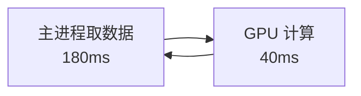
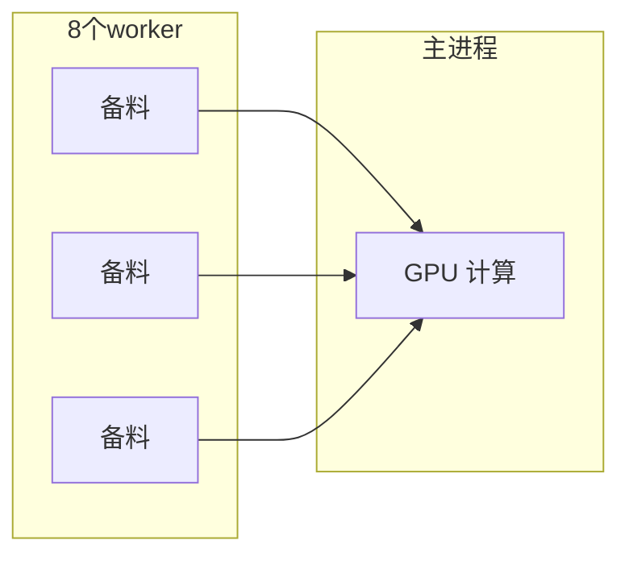
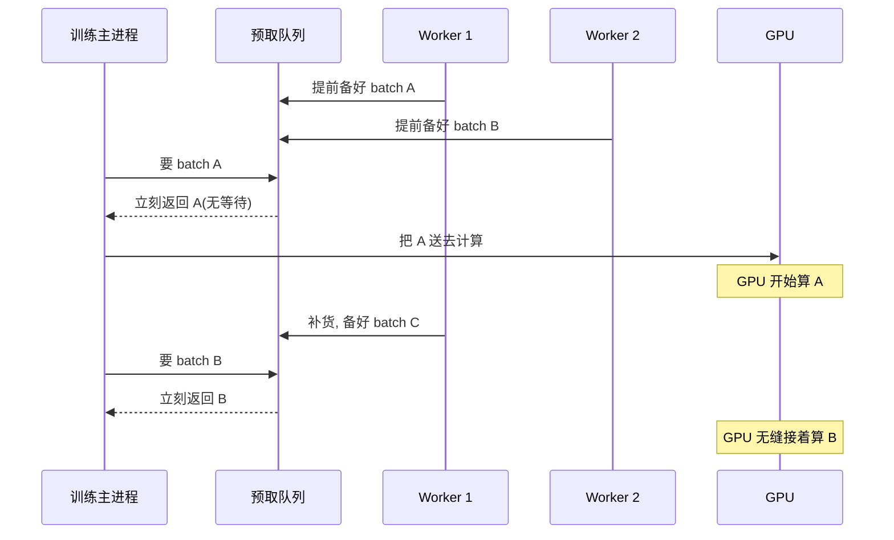

在[第 3 章](/blog/posts/gpu-util-03-decision-tree/)里,我们画出了完整的排查决策树,知道了 GPU 空闲有四大根因:数据饥饿、隐形等待、kernel 太小、显存受限。现在,我们要开始**逐个击破**了。

<!-- more -->

第一个要治的,也是最常见、最容易治、性价比最高的病——**数据饥饿**。

---

## 4.1 先讲个餐厅的故事

想象你开了一家餐厅,后厨有一位大厨(GPU)和一位配菜员(CPU)。

大厨炒菜**飞快**,一份菜只要 40 秒。但是他有个死规矩:**必须等配菜员把下一份菜的料全部洗好切好,他才肯开火。**

问题是,配菜员洗菜切菜**很慢**,一份要 180 秒。

于是后厨的日常变成了这样:

- 大厨花 40 秒炒完一份菜。
- 然后**干等 180 秒**,看着配菜员慢悠悠地洗切。
- 再炒 40 秒,再干等 180 秒……

算一下大厨的"忙碌率":40 ÷ (40 + 180) ≈ **18%**。也就是说,大厨有 82% 的时间在**发呆**。

**这就是"数据饥饿"。** GPU 就是那个大厨,CPU 就是那个配菜员。GPU 算完一个 batch 只要几十毫秒,却要眼睁睁等 CPU 花一百多毫秒去"搓"下一个 batch。

---

## 4.2 病理:为什么会这样?

回忆我们贯穿案例里的那行代码:

```python
loader = DataLoader(ds, batch_size=16, num_workers=0)  # 病灶在这里!
```

关键就是 `num_workers=0`。这个参数的默认值是 0,意思是:**取数据这件事,由主进程一个人干。**

于是整个训练循环变成了**串行**的:



看到问题了吗?**取数据和 GPU 计算是排队的**,一个做完才做下一个。取数据的时候 GPU 闲着,GPU 计算的时候 CPU 闲着。两个工人轮流上班,谁都没法连续干活。

**药方的核心思路就一句话:让取数和计算"同时"进行。**

---

## 4.3 药方一:多进程预取(性价比之王)

怎么让取数和计算同时进行?答案是:**多雇几个配菜员,让他们提前备货。**

PyTorch 的 `DataLoader` 早就为我们准备好了这个功能,只需要改几个参数:

```python
loader = DataLoader(
    ds, batch_size=16,
    num_workers=8,           # 雇 8 个配菜员并行备料
    pin_memory=True,         # 用"锁页内存", 上菜更快
    persistent_workers=True, # 配菜员别下班, 一直待命
    prefetch_factor=4,       # 每人提前备好 4 份料
)
```

就这四行,是**整个优化系列里性价比最高的改动**。我们一个一个解释。

### 参数一:`num_workers=8`

这是**雇几个配菜员**。设成 8,就开 8 个子进程,并行地读文件、解码、tokenize。

主进程(GPU 那边)需要数据时,直接从备好的队列里拿,不用自己动手。**取数和计算就重叠起来了。**



### 参数二:`pin_memory=True`

这是**用"锁页内存"**。

普通的内存,数据从 CPU 搬到 GPU 时,得先"复印"一份到一块特殊区域才能搬,慢。锁页内存(pinned memory)就是提前把这块区域锁好,让数据可以直接搬,**走 DMA 异步通道**,又快又不占用 CPU。

打个比方:普通内存上菜要经过前台转交,锁页内存是**后厨直通餐桌**。

### 参数三:`persistent_workers=True`

这是**别让配菜员下班**。

默认情况下,每跑完一个 epoch(一整轮数据),所有 worker 会被杀掉,下一个 epoch 再重新招人。这个"招人"的过程就是**冷启动**,要重新加载数据、重新初始化,很浪费时间。

设成 `True`,worker 就一直在,epoch 之间无缝衔接。

### 参数四:`prefetch_factor=4`

这是**每个配菜员提前备几份料**。

设成 4,意味着每个 worker 会提前准备好 4 个 batch 放在队列里。GPU 随时来拿,永远有存货。

---

## 4.4 `num_workers` 到底设多少?

这是新手最常问的问题。答案是:**没有标准答案,得试。**

给你一个起步公式和判断标准:

- **起步值**:CPU 核数的**一半到一倍**。比如 16 核的机器,从 8 开始试。
- **判断标准**:逐步加大 `num_workers`,**盯着 util 看**。
  - 如果 util 还在涨 → 继续加。
  - 如果**加了 worker,util 却不涨了** → 说明瓶颈已经移走了,可以停了。

> **记住这个判断标准:"再加 worker 而 util 不涨",说明数据流水线不再是瓶颈。** 这时候再多的 worker 只是浪费 CPU 和内存。

---

## 4.5 一个必须避开的坑

有一个经典的坑,新手几乎必踩:

**不要在 `Dataset.__init__` 里 decode 整个数据集。**

为什么?因为 `num_workers=8` 时,`__init__` 会被**每个 worker 各跑一遍**。如果你在 `__init__` 里把整个数据集加载到内存,那 8 个 worker 就会**各自复制一份**,内存瞬间爆炸。

**正道是"懒加载"**:在 `__getitem__` 里才去读文件。

```python
class MyDataset(Dataset):
    def __init__(self, paths):
        self.paths = paths          # 只存路径, 不读文件
    
    def __getitem__(self, i):
        return torch.load(self.paths[i])  # 用到时才读
```

这样每个 worker 只读自己需要的那一个文件,内存友好,还能利用操作系统的**页缓存**(读过的文件下次更快)。

---

## 4.6 药方二:给 CPU 减负

光靠多进程还不够。如果每个 batch 的处理本身就特别重(比如解码大图、跑复杂的 tokenize),那再多 worker 也扛不住。这时候要从**源头减负**。

### 技巧一:离线预处理

**把确定性的变换提前算好,存起来。**

比如 tokenize,它不依赖模型、不依赖训练过程,完全可以在训练前**一次性算好**,存成 `.pt` / `.npy` / webdataset 格式。训练时只需读文件,不需要现算。

```python
# 训练前, 离线跑一次
for text in raw_texts:
    tokens = tokenizer(text)
    torch.save(tokens, f"{out_dir}/{i}.pt")
```

**代价**:占点磁盘。**收益**:训练时 CPU 几乎不干活,GPU 再也不饿。

### 技巧二:把预处理搬上 GPU

有些变换(比如图像 decode、resize)其实可以在 GPU 上做,而且快得离谱。

- 图像:用 **NVIDIA DALI**,或者 `torchvision.io.decode_jpeg(device="cuda")`。
- 文本:用 `datasets.map(num_proc=...)` 批量预 tokenize。

### 技巧三:合并小文件

如果你的数据集是**几十万个小文件**,那 IO 会先崩——因为随机读小文件的 IOPS(每秒读写次数)是硬瓶颈。

**正道是打包成大文件**:比如 webdataset、`np.memmap`,把数据拼成几个大文件,**顺序读**。顺序读的速度比随机读小文件快几十倍。

---

## 4.7 药方三:传输优化

数据备好了,还得从 CPU 内存**搬到 GPU 显存**(这叫 H2D 拷贝)。这一步也有讲究。

### 技巧一:`pin_memory` + `non_blocking`

配合前面说的 `pin_memory=True`,在 `.to("cuda")` 时加上 `non_blocking=True`,拷贝就能**和计算重叠**——GPU 一边算上一个 batch,一边接收下一个 batch。

```python
x = x.to("cuda", non_blocking=True)
y = y.to("cuda", non_blocking=True)
```

### 技巧二:传紧凑张量,别传"套娃"

**别传 Python list、dict 套娃**,它们慢,而且无法异步拷贝。

**要传紧凑的 dtype 张量**,比如 `uint16`、`int32`,内存连续,拷贝飞快。

---

## 4.8 内部机制:一次取数到底发生了什么?

我们把整个过程用一张时序图串起来。假设你已经配置好了 `num_workers=2, prefetch_factor=2`:



**关键点**:GPU 在算 A 的时候,worker 已经在后台备 C 了。**取数和计算完全重叠**,GPU 一刻不停。

这就是为什么多进程预取这么有效——它把"串行"变成了"流水线"。

---

## 4.9 验收:怎么知道修好了?

改完代码,跑一次我们[第 3 章](/blog/posts/gpu-util-03-decision-tree/)里写的复测脚本,再拍一次 Profiler 时间线。

**验收标准不是"我参数调了",而是时间线上的空洞消失了。**

回顾贯穿案例的修复效果:

| 指标 | 修复前 | 修复后 |
|------|--------|--------|
| step 耗时 | 285ms | 130ms |
| GPU-Util | 35% | 55% |
| 功耗 | 90W | 150W |
| step 开头空洞 | 有(180ms) | **消失** |

**每步耗时腰斩,util 涨了 20 个点,功耗涨了 60W。** 这就是"数据流水线四件套"的威力。

> **注意**:util 从 35% 涨到 55%,但还没到 90%。这很正常!因为我们的案例是"四病齐全",数据饥饿只是第一个病。修好它,下一个病(同步点)才会露出来。这正是[第 3 章](/blog/posts/gpu-util-03-decision-tree/)讲的"单变量修复"。

---

## 4.10 本章小结

恭喜!你已经掌握了**性价比最高**的一招。回顾一下重点:

1. **数据饥饿的本质**:取数和计算串行,GPU 干等 CPU 备料。
2. **四件套是性价比之王**:
   - `num_workers`:多进程并行备料
   - `pin_memory`:锁页内存,上菜更快
   - `persistent_workers`:worker 不下班,免冷启动
   - `prefetch_factor`:提前备货,GPU 永不缺料
3. **`num_workers` 的判断标准**:再加 worker 而 util 不涨,说明瓶颈已移走。
4. **避开大坑**:别在 `__init__` 里 decode 整个数据集,要用懒加载。
5. **给 CPU 减负**:离线预处理、搬上 GPU、合并小文件。
6. **验收看空洞**:改完必须复测,看时间线空洞是不是消失了。

现在,GPU 已经不饿肚子了。但是 util 还是只有 55%——因为还有**别的病**在等着。下一个要治的,是那个每步都让 CPU 和 GPU "握手"的隐形杀手:**同步点**。

下一章,我们将学习如何去掉那些偷偷拖慢训练的同步点,让 CPU 不再卡住 GPU 的手脚。

➡️ [第 5 章: 同步点与 launch 开销](/blog/posts/gpu-util-05-sync-launch/)

---

Generated by [AI Codebase Knowledge Builder](https://github.com/The-Pocket/Tutorial-Codebase-Knowledge)