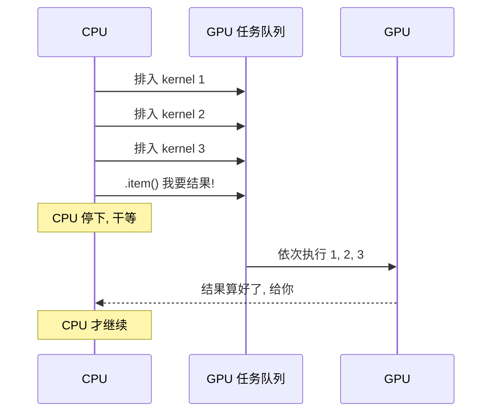
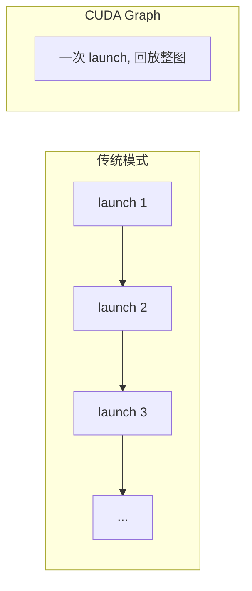
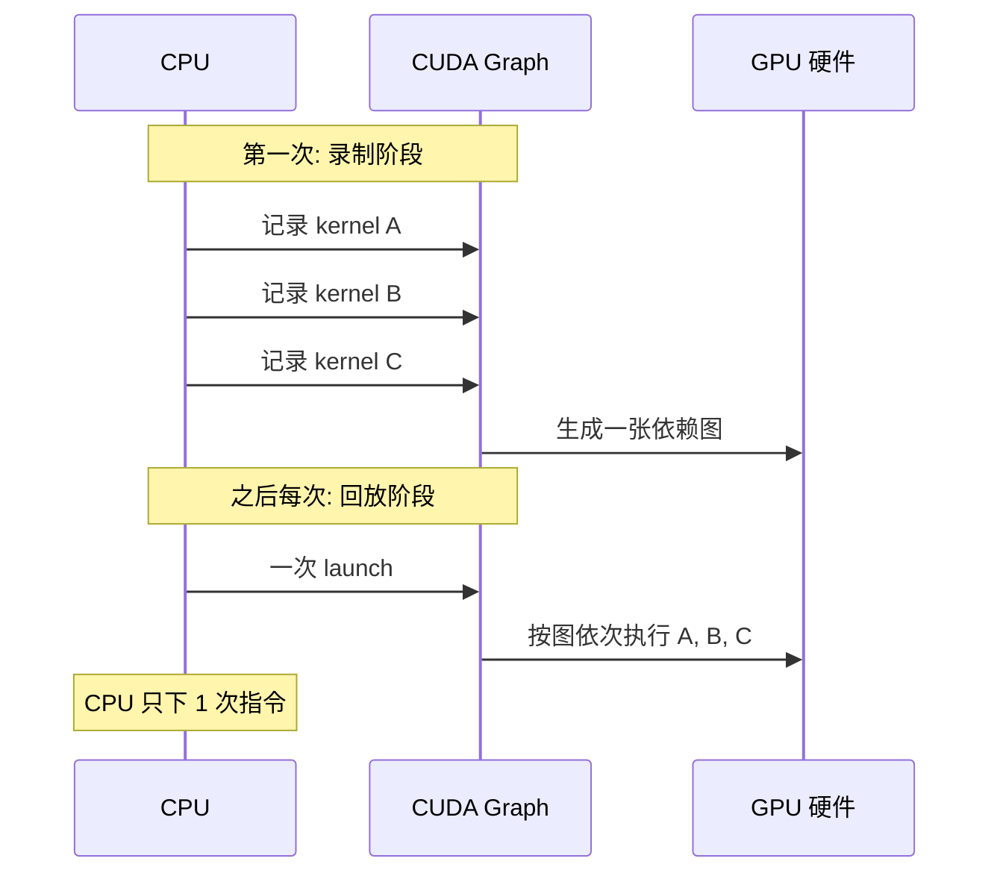

在[第 4 章](/blog/posts/gpu-util-04-data-pipeline/)里,我们治好了第一个病——数据饥饿。GPU 不再饿肚子了,util 从 35% 涨到了 55%,功耗也涨到了 150W。

<!-- more -->

但是,util 还是只有一半多。这说明**还有别的病在拖后腿**。

这一章,我们要揪出那个最隐蔽、最阴险的凶手——**同步点**,以及它的帮凶——**launch 开销**。它们不像数据饥饿那样明晃晃地摆在那里,而是像"隐形的手铐",悄悄地锁住 GPU 的手脚。

---

## 5.1 先讲个点外卖的故事

想象你在公司加班,想点外卖。

老板让你统计一下"这一周,团队每天花了多少饭钱"。你打开外卖 App,发现每一单都能看到金额。于是你做了一个"聪明"的统计:

- 周一:打开 App,查一单,记下金额,**关掉 App**。
- 周二:打开 App,查一单,记下金额,**关掉 App**。
- 周三:打开 App,查一单,记下金额,**关掉 App**。
- ……

你觉得这没什么问题,对吧?

**但如果每次"打开 App"都要加载 5 秒钟呢?** 查 100 单,光加载就花 500 秒。而如果你一次打开 App,把 100 单全看完,只要 5 秒。

**这就是"同步点"的代价。** 每一次"打开 App"就像一次 CPU 和 GPU 的"握手",握手本身很便宜,但握手的**等待**很贵。

---

## 5.2 病理:PyTorch 是"异步执行"的

要理解同步点,得先理解 PyTorch 的一个核心设计:**异步执行**。

当你写下这行代码:

```python
loss = model(x, labels=y).loss
```

你以为 CPU 在"算 loss"。**错!** CPU 只是**下了一道指令**,把"算 loss"这个任务排进了 GPU 的任务队列,然后**立刻返回**,继续执行下一行代码。

真正的计算,是 GPU 在后台**异步**做的。

这就像**餐厅点餐**:

- 你把订单交给服务员(CPU 下指令)。
- 服务员转身就走,去招呼下一桌(CPU 继续跑)。
- 后厨(GPU)慢慢做菜。

**这是好事!** 正因为异步,CPU 才能不停地下指令,GPU 才能一直有活干,两者并行不悖。

### 但是,有些操作必须"看到结果"

问题来了。有些操作**必须拿到具体的数值**才能继续,比如:

```python
print(loss.item())   # 我要把这个数字打印出来
```

`loss.item()` 的意思是:"把 loss 这个张量的**具体数值**给我。"

可是 loss 还在 GPU 上算着呢!CPU 手里只有一个"任务编号",没有数值。怎么办?

**CPU 只能停下来,等 GPU 把队列里的活全干完,把数值算出来,再返回给 CPU。**

这就是一次**同步点**(也叫"握手")。



看到关键点了吗?**CPU 停下等待的这段时间,GPU 虽然还在跑,但 CPU 已经没法下新指令了。** 等 GPU 把队列清空,CPU 才拿到结果,才能继续下指令——但这时候 GPU 又空着了,得等 CPU 下完指令才能继续跑。

**一握手,双方都得停下来等对方。** 就像流水线上突然有人喊"停,让我看一眼"。

---

## 5.3 哪些操作会触发同步?

新手最容易踩坑的地方,是**根本不知道自己写的代码触发了同步**。下面这些操作,**全都是同步点**:

```python
print(loss.item())              # .item() 要数值
acc = pred.cpu()                # .cpu() 要搬回主机
arr = tensor.numpy()            # .numpy() 要转成 numpy
if loss < best: ...             # Python if 依赖 GPU 值
print(tensor)                   # 打印张量也要看数值
```

它们有一个共同点:**都需要"看到"GPU 上的具体数值**。

**记住这个口诀:凡是让 CPU "看一眼" GPU 数值的操作,都是同步点。**

单个同步点可能只花几毫秒,不显眼。但如果你**每个 step 都来一遍**,几千个 step 累计起来,就是**小时级的浪费**。

---

## 5.4 药方一:降频握手(最便宜的修复)

好消息是:**我们不需要消灭日志,只需要降低握手的频率。**

新手代码长这样:

```python
for step, batch in enumerate(loader):
    loss = model(batch).loss
    loss.backward()
    print(step, loss.item())   # 每个 step 都握手!
```

改成这样:

```python
running_loss = 0.0
for step, batch in enumerate(loader):
    loss = model(batch).loss
    loss.backward()
    running_loss += loss.detach()      # 在 GPU 上累积, 不握手
    if step % 50 == 0:                 # 每 50 步才握手一次
        print(step, running_loss.item() / 50)
        running_loss = 0.0
```

逐行解释:

- `running_loss += loss.detach()`:把 loss 累积在 GPU 上,**不触发同步**。`detach()` 是为了切断梯度,避免显存泄漏。
- `if step % 50 == 0`:每 50 步才打印一次。**握手频率降低 50 倍。**
- `running_loss.item()`:只有打印这一行才真正触发同步。

**效果**:原本每步一次握手,现在每 50 步一次。假设每步 285ms,每次握手浪费 3ms,那原来浪费 3ms/step,现在只浪费 0.06ms/step——**几乎可以忽略**。

> **小提示**:`running_loss` 用 `float` 累加会触发隐式同步。稳妥的写法是保持它是 GPU 张量,像上面这样。

---

## 5.5 药方二:把判断逻辑也搬到 GPU 上

除了日志,还有一种常见的同步点:**Python 里的 `if` 判断依赖 GPU 值**。

```python
if loss < best_loss:      # 触发同步!
    best_loss = loss
    save_checkpoint()
```

每次循环都要把 loss 取回 CPU 比较一次,又是一次握手。

**改法**:把"比较"这个动作也放到 GPU 上,或者降低它的频率。

```python
# 方案 A: 累积到 GPU 上, 定期比较
losses.append(loss.detach())
if step % 100 == 0:
    avg = torch.stack(losses).mean().item()   # 才握手一次
    if avg < best_loss: ...
    losses.clear()
```

**核心思想**:凡是能"攒着一起做"的操作,就别"每步做一次"。

---

## 5.6 帮凶登场:launch 开销

治疗完同步点,GPU 的手铐解开了一半。但还有另一个隐形杀手——**launch 开销**。

### 什么是 launch 开销?

CUDA 里,每个 kernel 从"排队"到"真正开始执行",都有一个**固定的开销**:

- 驱动要解析指令
- 调度器要分配资源
- 硬件要分发到各个 SM

这一套流程,大概要花 **几微秒**。

单个 kernel 的开销很小。**但如果你的模型由成千上万个小 kernel 组成呢?**

想象一下:每个 kernel 干活只要 **2-3 微秒**,但排队等待要 **5 微秒**。那 GPU 的时间就变成了:

$$\frac{3}{3 + 5} \approx 37\% \text{ 在算, } 63\% \text{ 在等排队}$$

**GPU 看起来在 100% 忙,其实大部分时间都在"排队",不是在算。** 这就是[第 1 章](/blog/posts/gpu-util-01-metrics/)里说的"假满载"——util 高,但功耗上不去。

### launch 开销的典型来源

- **Python for 循环做小张量操作**:比如逐 token、逐行做 softmax、mask。
- **每个 step 几十次 optimizer 参数更新**:每个参数一次小 kernel。
- **大量 `.to()` / `.view()` 调度**:每次都可能触发新 kernel。

**一句话总结:kernel 太碎,launch 开销就吃掉了大部分时间。**

---

## 5.7 药方三:CUDA Graph——把 N 次 launch 合成 1 次

怎么治 launch 开销?答案是 **CUDA Graph**。

### 核心思路

CUDA Graph 的脑洞很简单:**既然每次跑的 kernel 序列都一样,那为什么不录下来,以后一键回放?**

- **第一次跑**:录下整串 kernel 的依赖图(像录视频)。
- **之后跑**:一键回放整张图,**N 次 launch 变成 1 次**。



### PyTorch 里最省事的入口

PyTorch 早就帮你封装好了,**一行代码就能用**:

```python
model = torch.compile(model, mode="reduce-overhead")  # 自动启用 CUDA Graph
```

`mode="reduce-overhead"` 就是告诉 PyTorch:"我要减少 launch 开销,帮我上 CUDA Graph。"

### 三个必须注意的坑

CUDA Graph 很香,但不是万能的。用之前必须知道这三点:

1. **输入形状必须固定。** Graph 是"录"下来的,形状一变就得重录。变长序列要**pad 到定长**,或者**按长度分桶**。
2. **录图期间控制流被"焊死"。** 如果模型里有 `if` 分支,那个分支在录图时就被固定了。动态分支要**放到图外**。
3. **小 kernel 风暴场景收益最大。** 如果你的模型都是大 kernel(比如大矩阵乘法),收益有限。**碎 kernel 越多,收益越大。**

---

## 5.8 内部机制:一次 CUDA Graph 回放发生了什么?

我们用一张时序图,看看 CUDA Graph 到底做了什么:



**关键**:CPU 只下 **1 次**指令,GPU 自动按图执行所有 kernel。launch 开销从 N 次变成 1 次。

---

## 5.9 验收:贯穿案例的修复效果

回到我们的案例。治疗完同步点 + 上 CUDA Graph 后,成绩单如下:

| 指标 | 修复前 | 修复后 |
|------|--------|--------|
| step 耗时 | 130ms | 112ms |
| GPU-Util | 55% | 65% |
| 功耗 | 150W | 200W |

**step 耗时降了 18ms,util 涨了 10 个点,功耗涨了 50W。** step 内部的细缝被填平了。

但注意:**util 还是只有 65%,没到 90%。** 为什么?

因为现在的瓶颈变成了——**GPU 自己干的活太碎**。虽然 launch 开销被 CUDA Graph 消掉了,但 GPU 内部还是在跑一堆小 kernel,算力没打满。

**这是下一个病:算子融合。** 我们会在[第 6 章](/blog/posts/gpu-util-06-kernel-fusion/)专门治它。

---

## 5.10 本章小结

恭喜!你已经掌握了"解手铐"的手艺。回顾一下重点:

1. **PyTorch 是异步执行的**:CPU 下指令立刻返回,GPU 在后面慢慢跑。
2. **同步点 = 强制握手**:`.item()` / `.cpu()` / `.numpy()` / `print(tensor)` / Python `if` 依赖 GPU 值,都会让 CPU 停下等 GPU。
3. **单个同步点几毫秒,几千 step 累计就是小时级浪费。**
4. **药方一:降频握手**。指标在 GPU 上累积,每 50 步才 `.item()` 一次。
5. **launch 开销 = kernel 排队的固定成本**。kernel 太碎时,GPU 大部分时间在排队,不在算。
6. **药方二:CUDA Graph**。`torch.compile(model, mode="reduce-overhead")` 一行搞定,N 次 launch 变 1 次。
7. **CUDA Graph 的三个坑**:形状要固定、控制流被焊死、小 kernel 收益大。

现在,GPU 的手铐解开了,launch 开销也省了。但 util 还是只有 65%——因为 GPU 内部还在跑一堆碎 kernel,算力没打满。

下一章,我们将学习如何把这些碎 kernel **融合**成一个大 kernel,让 GPU 真正"满载"。

➡️ [第 6 章: 算子融合](/blog/posts/gpu-util-06-kernel-fusion/)

---

Generated by [AI Codebase Knowledge Builder](https://github.com/The-Pocket/Tutorial-Codebase-Knowledge)