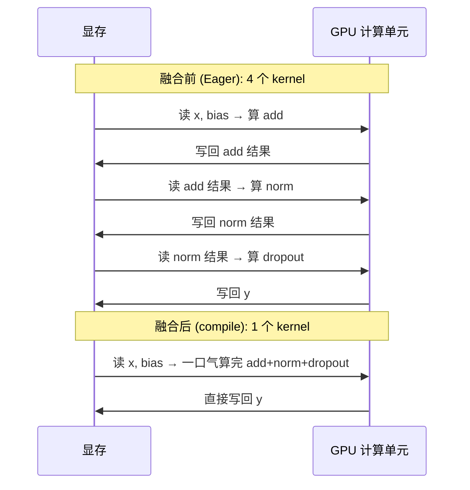

在[第 5 章](/blog/posts/gpu-util-05-sync-launch/)里,我们解开了 CPU 和 GPU 之间的"手铐"——去掉了同步点,又用 CUDA Graph 消掉了 launch 开销。成绩单上,util 从 55% 涨到了 65%,功耗从 150W 涨到了 200W。

<!-- more -->

但是,util 还是只有 65%,离 90% 还差得远。这时候你打开 `nvidia-smi`,会看到一个非常诡异的现象:

> **util 显示接近 100%,但功耗只有 200W 出头(额定 350W)。**

这就是我们在[第 1 章](/blog/posts/gpu-util-01-metrics/)里说的"**假满载**"——GPU 看起来很忙,但其实没出多少力。

这一章,我们要治的就是这个病:**算子融合**。

---

## 6.1 先讲个大厨的故事

回忆第 1 章那个工厂的比喻。现在换个场景:一家**米其林餐厅**,后厨有一位超级大厨(GPU)。

这位大厨炒菜的手速**快得离谱**,一份菜下锅到出锅只要 **0.1 秒**。但是他有个**死板的规矩**:

> **每炒一步,必须洗一次锅。**

于是,炒一份"番茄炒蛋"的流程变成了:

1. 洗锅 → 倒油 → 炒蛋 → **洗锅**
2. 洗锅 → 倒油 → 炒番茄 → **洗锅**
3. 洗锅 → 倒油 → 混合翻炒 → **洗锅**
4. 洗锅 → 装盘 → **洗锅**

你看,**真正炒菜的时间可能只有 0.3 秒,但洗锅的时间加起来有 2 秒!** 大厨 87% 的时间都在洗锅,不是在炒菜。

**这就是"碎 kernel"的真相。** 在 PyTorch 的 Eager 模式下,一层神经网络会被拆成一堆小操作:

- `add`(加法)→ 一个 kernel
- `layer_norm`(归一化)→ 一个 kernel
- `dropout`(随机失活)→ 一个 kernel
- `cast`(类型转换)→ 一个 kernel

每一个 kernel 都**只用了几个百分点的 SM**(算力单元),算得飞快,但**中间结果要写回显存,再读出来**给下一个 kernel——就像每次炒完一步都要"洗锅"。

**开销全在"搬运和排队",不在"计算"。**

---

## 6.2 病理:为什么 kernel 会这么碎?

我们来看一段真实的代码。这是 Transformer 里的一个前馈层(简化版):

```python
x = self.linear1(x)          # kernel 1: 矩阵乘法
x = self.activation(x)       # kernel 2: 激活函数
x = self.dropout(x)          # kernel 3: 随机失活
x = self.linear2(x)          # kernel 4: 矩阵乘法
```

在 PyTorch 的 **Eager 模式**(默认模式)下,这 4 行代码会**老老实实地启动 4 个独立的 kernel**。

每个 kernel 都要经历这样的流程:


看到问题了吗?**中间的 `x` 被反复地写进显存、再读出来**。而显存的读写带宽是有限的,这就成了瓶颈。

更糟的是,每个 kernel 都很小,启动它们本身也有开销(回忆[第 5 章](/blog/posts/gpu-util-05-sync-launch/)讲的 launch 开销)。**kernel 越小,这个开销占比越高。**

用一句流行的话总结:

> **Eager 模式下,GPU 不是在"计算",而是在"搬运和排队"。**

---

## 6.3 药方一:torch.compile(整体编译融合)

最省事的修复方式,是让 PyTorch 帮你**自动融合**这些碎 kernel。

PyTorch 2.0 之后,官方提供了一个"一键加速"的入口:

```python
model = torch.compile(model)   # 一行搞定
```

就这样。**一行代码,自动融合。**

### 它做了什么?

`torch.compile` 背后是 PyTorch 的 **Inductor** 编译器。它会:

1. **把模型的计算图抓下来**(把那一堆小操作看成一个整体)。
2. **自动融合**能融合的算子(比如把 `add + norm + dropout` 合成一个大 kernel)。
3. **把中间结果留在寄存器 / 共享内存里**,不再反复写回显存。

效果就像**让大厨一口气把整道菜炒完,中间不洗锅**。

### 编译的代价

天下没有免费的午餐。`torch.compile` 的代价是:

- **首次运行有编译耗时**(分钟级)。第一次跑的时候,你会看到程序卡住好一会儿,别慌,它在编译。
- **编译一次,之后一直受益**。稳定训练后,这点编译时间很快就回本了。

### 三种模式

`torch.compile` 有三种常用模式,你可以根据需要选:

```python
model = torch.compile(model)                          # 默认: 平衡
model = torch.compile(model, mode="reduce-overhead")  # 启用 CUDA Graph
model = torch.compile(model, mode="max-autotune")     # 最激进, 编译最久
```

- **默认模式**:平衡编译时间和运行速度,适合大多数场景。
- **`reduce-overhead`**:会启用[第 5 章](/blog/posts/gpu-util-05-sync-launch/)讲的 CUDA Graph,进一步减少 launch 开销。
- **`max-autotune`**:最激进,会花更多时间搜索最快的 kernel,适合**长时间训练**。

**新手建议**:先用默认模式,跑通了再考虑换其他模式。

---

## 6.4 药方二:高效算子替换

除了整体编译,还有一些"点对点"的替换,能把特定的碎 kernel 换成**一个高效大 kernel**。这是**性价比极高**的优化。

### 替换一:用 SDPA 替代手写注意力

**手写注意力**长这样:

```python
attn = torch.softmax(q @ k.transpose(-2, -1) / scale, dim=-1) @ v
```

这一行看起来简洁,但**背后是一堆碎 kernel**:矩阵乘法、除法、softmax、再矩阵乘法……每个都是一个 kernel,中间结果反复读写显存。

**正道是用 PyTorch 官方的 `scaled_dot_product_attention`(简称 SDPA)**:

```python
import torch.nn.functional as F
out = F.scaled_dot_product_attention(q, k, v, is_causal=True)
```

**一行替代,一步到位。**

SDPA 内部会根据你的硬件**自动选择最优实现**(比如 FlashAttention、memory-efficient kernel),把整个注意力计算**融合成一个大 kernel**。速度快、显存省,而且**数值上等价**。

> **注意**:`is_causal=True` 表示因果掩码(用于 GPT 类模型)。如果你的注意力不是因果的,把它去掉。

### 替换二:用 fused AdamW 替代普通 AdamW

优化器的参数更新,也是一个"碎 kernel 重灾区"。普通的 AdamW 会**为每个参数单独启动一堆小 kernel**,参数越多,launch 风暴越严重。

**正道是用 fused 版本**:

```python
opt = torch.optim.AdamW(params, lr=3e-4, fused=True)
```

就加一个 `fused=True`,PyTorch 会把所有参数的更新**合并成少量大 kernel**。对于大模型,这个改动能省下不少时间。

### 替换三:cuDNN 自动搜索

如果你在训**卷积网络**(比如 ResNet、ViT 的某些变体),加这一行:

```python
torch.backends.cudnn.benchmark = True
```

它会让 cuDNN 在**第一次运行时**,为你的固定输入形状**搜索最快的卷积实现**,之后一直用最快的那个。

> **小提示**:这行代码**只对固定形状的输入有效**。如果你的输入形状每次都变,反而会变慢(每次都要重新搜索)。

### 替换四:channels_last 记忆格式

图像模型还有个冷门技巧:把张量的记忆格式改成 `channels_last`。在某些 GPU 上,这个格式能让卷积**快好几倍**。

```python
model = model.to(memory_format=torch.channels_last)
```

具体效果取决于模型和硬件,值得一试。

---

## 6.5 药方三:干掉 Python 循环

最后,还有一个**最容易被忽视**的碎 kernel 来源:**Python 的逐元素循环**。

看这段代码:

```python
for i in range(batch_size):        # 逐样本循环
    outputs[i] = process(inputs[i])
```

看起来没什么问题,对吧?**但它会触发 batch_size 次 kernel 启动!**

如果 `batch_size=64`,那就是 64 次 kernel 启动。每次 launch 开销几微秒,64 次就是几百微秒——**GPU 全在排队,不是在算。**

**正道是向量化**:把循环改成**一次性处理整块张量**。

```python
outputs = process(inputs)          # 一次性处理整个 batch
```

PyTorch 会自动把整块张量**并行地**喂给 GPU,一个 kernel 搞定。

> **口诀:凡是能用张量一次算的,就别用 Python 循环。**

常见的循环重灾区:

- 逐 token 的 softmax、mask 操作
- 逐样本的数据增强
- 检索、排序里的循环

**能向量化的向量化,不能向量化的就 batch 化接口。**

---

## 6.6 内部机制:一次融合发生了什么?

我们用一张时序图,看看融合前后到底发生了什么。

假设我们要算 `y = dropout(layernorm(x + bias))`:



**关键差异**:

- **融合前**:显存被读写 **3 次**(每次 kernel 都要读一次、写一次),中间结果反复搬运。
- **融合后**:显存只读写 **1 次**,中间结果全留在**寄存器 / 共享内存**里,根本不出 GPU 计算单元。

这就是为什么融合能**大幅提速**——它把"搬运"变成了"计算"。

---

## 6.7 深入一点点:Inductor 是怎么融合的?

`torch.compile` 背后的 Inductor 编译器,工作流程大致是:


1. **捕获计算图**:把 Python 里的那一堆小操作,翻译成一张"操作依赖图"。
2. **分析依赖**:找出哪些操作可以"合并"在一起做(比如逐元素的 add、mul、激活函数,天然适合融合)。
3. **生成融合 kernel**:把能融合的操作,写成一个**大 kernel**。
4. **编译并缓存**:编译成 GPU 能跑的原生代码,缓存起来,下次直接用。

**新手不用懂这些细节**,只要记住:**`torch.compile` 会自动帮你做这些事。**

---

## 6.8 验收:贯穿案例的修复效果

回到我们的案例。治疗完碎 kernel 后,成绩单如下:

| 指标 | 修复前 | 修复后 |
|------|--------|--------|
| step 耗时 | 112ms | 96ms |
| GPU-Util | 65% | 75% |
| 功耗 | 200W | 260W |

**step 耗时降了 16ms,util 涨了 10 个点,功耗涨了 60W。**

**注意功耗的变化**:从 200W 涨到 260W,这说明 GPU **真的开始出力了**。之前那个"util 高功耗低"的假满载现象,现在**明显缓解**。

但是,util 还是只有 75%,离 90% 还差 15 个点。为什么?

因为现在的瓶颈**转移了**。算子密度上去了,GPU 每步能算的活就那么多,**单卡的天花板只剩 batch 规模**——batch 太小,喂不饱 GPU。

**这是下一个病:显存受限。** 我们会在[第 7 章](/blog/posts/gpu-util-07-memory-batch/)专门治它。

---

## 6.9 本章小结

恭喜!你已经掌握了"让 kernel 吃得更饱"的手艺。回顾一下重点:

1. **碎 kernel 的本质**:Eager 模式把一层拆成一堆小 kernel,开销全在"搬运和排队",不在"计算"。
2. **假满载的特征**:util 高(接近 100%),但功耗低。
3. **药方一:`torch.compile(model)` 一行搞定**。Inductor 自动融合算子,中间结果留在寄存器。
4. **药方二:高效算子替换**。
   - 注意力:`F.scaled_dot_product_attention` 替代手写
   - 优化器:`AdamW(..., fused=True)`
   - 卷积:`torch.backends.cudnn.benchmark = True`
   - 图像:`channels_last` 记忆格式
5. **药方三:干掉 Python 循环**。向量化 / batch 化,让整块张量一次算。
6. **验收看功耗**:功耗涨上去,才是真的"满载"。

现在,GPU 已经能"吃得更饱"了,但 batch 规模成了新的天花板。**显存不够大,batch 就上不去,GPU 就永远差那么一口气。**

下一章,我们将学习如何通过**显存腾挪**技巧,把 batch 放大,让 GPU 真正跑满。

➡️ [第 7 章: 显存腾挪与 batch 放大](/blog/posts/gpu-util-07-memory-batch/)

---

Generated by [AI Codebase Knowledge Builder](https://github.com/The-Pocket/Tutorial-Codebase-Knowledge)