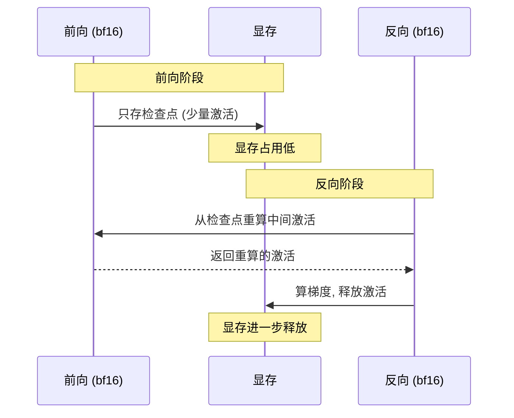

在[第 6 章](/blog/posts/gpu-util-06-kernel-fusion/)里,我们用 `torch.compile` 和高效算子替换,把碎 kernel 融合成了大 kernel。成绩单上,util 从 65% 涨到了 75%,功耗从 200W 涨到了 260W。

<!-- more -->

但是,util 还是只有 75%,离 90% 的满载目标还差 15 个点。这时候你打开 `nvidia-smi`,会看到一个让人困惑的现象:

> **util 显示 75%,功耗 260W,但显存已经用了 9GB——想加大 batch,却总是 OOM(显存不够)。**

这就是单卡的**最后一道天花板**:**任务规模不够大**。

这一章,我们要治的就是这个病:**显存腾挪与 batch 放大**。

---

## 7.1 先讲个仓库的故事

想象你是一个仓库管理员,仓库(GPU 显存)只有 24 平米。

你的工作是把货物(数据)搬进来,让工人(GPU 计算单元)打包。工人打包的速度**飞快**,但有个前提:**货架上必须摆满货,他才肯开工。**

问题来了:你的仓库里**堆满了杂物**——

- 一批**长期存货**(模型参数):占 4 平米
- 一批**临时中转货**(梯度):占 4 平米
- 一批**账本**(优化器状态):占 8 平米
- 剩下的空间才摆**待打包的货**(激活值)

结果,你只能摆下 **16 箱货**(小 batch)。工人每次只能打包 16 箱,打包完就闲着,等下一批。**工人大部分时间都在等货,而不是在打包。**

**这就是"显存受限"的真相。** 不是 GPU 算不动,而是**显存被杂物占满了,摆不下足够多的货**。

**药方的核心思路:腾挪——把杂物压缩、搬到别处,腾出空间摆更多的货。**

---

## 7.2 先记账:显存都去哪了?

在动手之前,我们得先知道**显存被谁吃掉了**。PyTorch 提供了两个好用的工具:

```python
print(torch.cuda.memory_allocated() / 1e9, "GB 已用")
print(torch.cuda.memory_summary())   # 详细分布
```

逐行解释:

- `memory_allocated()`:当前**实际被张量占用**的显存(单位字节,除以 1e9 换成 GB)。
- `memory_summary()`:打印一张详细的表格,告诉你显存被哪些部分占用了。

跑一下,你会看到类似这样的分布:

| 组成部分 | 大小 | 说明 |
|---------|------|------|
| 参数 | 4GB | 模型权重 |
| 梯度 | 4GB | 反向传播算出来的 |
| 优化器状态 | 8GB | AdamW 每个参数存两份 fp32 |
| 激活值 | ?GB | 前向过程的中间结果 |

**关键洞察**:对于 10 亿参数的模型,光是**参数 + 梯度 + 优化器状态**就吃掉了 **16GB**,还没算激活值!

> **一个残酷的算术**:AdamW 优化器要为**每个参数**存两份 fp32 状态(一阶动量 + 二阶动量)。10 亿参数 × 4 字节 × 2 = 8GB。这就是为什么优化器状态这么"重"。

所以,**腾挪显存的三个方向**就是:

1. **压缩参数 / 梯度 / 优化器状态**(AMP 混合精度)
2. **压缩激活值**(梯度检查点)
3. **减少碎片**(expandable_segments)

我们一个一个讲。

---

## 7.3 药方一:混合精度 AMP(显存近半)

这是**性价比最高**的一招。核心思路:**前向和反向用 bf16 算,显存占用减半,速度还更快。**

```python
with torch.amp.autocast("cuda", dtype=torch.bfloat16):
    loss = model(x, labels=y).loss
loss.backward()
opt.step(); opt.zero_grad()
```

逐行解释:

- `torch.amp.autocast("cuda", dtype=torch.bfloat16)`:在这个上下文里,所有计算**自动用 bf16 精度**。
- 出了这个 `with` 块,精度恢复默认。
- 关键:**你不需要改模型代码**,PyTorch 自动帮你做类型转换。

### bf16 vs fp16:选哪个?

这是新手最常纠结的问题。答案很简单:

- **bf16**:数值范围和 fp32 一样,**不会溢出**,**不需要 GradScaler**。Ampere 及以后的 GPU(30 系、40 系、A100、H100)**无脑选它**。
- **fp16**:数值范围小,容易下溢,需要配合 `GradScaler` 做缩放。**只在老硬件(如 V100)上用**。

如果你用的是 RTX 3090,**直接用 bf16,不用管 GradScaler**。

### 效果

- **显存**:前向/反向的激活值减半。
- **速度**:张量核心(Tensor Core)对 bf16 的吞吐是 fp32 的**数倍**。

> **注意**:模型权重和优化器的主状态**通常仍保留 fp32**,AMP 只影响**计算精度**。所以显存不会真的减半,但会**显著下降**。

---

## 7.4 药方二:梯度检查点(重算换显存)

如果激活值占了大头,那还有一招更狠的:**梯度检查点**。

### 核心思路

**正常的反向传播**,需要把前向过程的所有中间激活值都存下来,反向时才能算梯度。这些激活值**又大又多**,是显存杀手。

**梯度检查点的脑洞**:**前向时只存几个"检查点",反向时从检查点重新算一遍中间激活值。**

就像你看一本很厚的书,**不记每一页的内容,只记章节标题**,需要细节时**重新翻到那一章看**。

```python
from torch.utils.checkpoint import checkpoint

out = checkpoint(model.layer_i, x)   # 前向不存激活, 反向时重算
```

逐行解释:

- `checkpoint(func, *args)`:把 `func`(比如某一层)包起来。
- 前向时,**不保存**这一层的中间激活。
- 反向时,**重新跑一遍前向**,把激活算出来。

### 代价与收益

- **代价**:反向多一次前向计算,**慢约 30%**。
- **收益**:显存**大幅下降**,能塞下**更大的 batch**。

**关键判断**:如果你的 GPU 是"算力过剩、显存不足"(比如 3090),那这 30% 的慢是**净赚**——因为你能开更大的 batch,整体吞吐反而更高。

> **HuggingFace 用户**:直接设 `gradient_checkpointing=True` 就行,不用手动包。

---

## 7.5 药方三:分配器与碎片

有时候你看到显存"用满了",但其实**不是真的用满了**,而是**碎片化了**。

### 什么是碎片?

想象一个停车场,总共 100 个车位,但车停得**东一辆西一辆**,中间留了一堆**零散的空位**。现在来了一辆大卡车,需要**连续 10 个车位**——虽然空位加起来有 30 个,但**没有连续的 10 个**,卡车停不进去。

**显存碎片**就是这个道理。长训练过程中,显存被反复分配、释放,慢慢就"碎"了。

### 症状

```python
print(torch.cuda.memory_summary())
```

你会看到 **`reserved`(预留)远大于 `allocated`(实际使用)**。比如 allocated 只有 9GB,但 reserved 却有 15GB——**6GB 被碎片浪费了**。

### 药方

加一个环境变量:

```bash
export PYTORCH_CUDA_ALLOC_CONF=expandable_segments:True
```

`expandable_segments` 让 PyTorch 的显存分配器**动态扩展段**,缓解碎片化。

> **小提示**:这个变量要在**启动 Python 之前**设好,或者用 `os.environ` 在代码最开头设。

---

## 7.6 最后一步:把腾出来的显存换成 batch

前面三招都是"腾挪",现在到了**收获**的时候:**把腾出来的显存,直接换成更大的 batch。**

```python
loader = DataLoader(ds, batch_size=64, ...)   # 从 16 加到 64
```

就改一个数字。但效果是**质变**:

- **GEMM 更肥**:大 batch 让矩阵乘法变得更大、更饱满。
- **SM 喂饱**:GPU 的每个计算单元都有足够的活干。
- **Tensor Core 效率更高**:大矩阵能充分利用张量核心的并行性。
- **功耗 / 带宽同时上台阶**:util 和功耗一起涨。

**这就是为什么 batch 放大是单卡优化的"最后一公里"。**

---

## 7.7 一个必须避开的坑:梯度累积 ≠ 大 batch

新手经常听到一个建议:**"显存不够,用梯度累积啊!"**

梯度累积是这样的:

```python
for i, batch in enumerate(loader):
    loss = model(batch).loss / accum_steps
    loss.backward()
    if (i + 1) % accum_steps == 0:
        opt.step(); opt.zero_grad()
```

它**累积几个小 batch 的梯度,再更新一次参数**。看起来"等效于大 batch",对吧?

**对数学等效,但对性能不等效!**

- **省显存**:是的,每个 micro-step 的显存占用还是小 batch 的量。
- **不提速**:**每个 micro-step 的 kernel 依然小**,SM 依然喂不饱,util 依然上不去。

**一句话总结**:

> **梯度累积是"显存受限时的折衷",不是"利用率优化手段"。** 它能让你**用有限的显存训更大的等效 batch**,但**不会提升吞吐**。

如果你的目标是**提升 GPU 利用率**,那**正道是腾显存、真放大 batch**,不是梯度累积。

---

## 7.8 内部机制:一次 AMP + checkpoint 发生了什么?

我们用一张时序图,看看前向 + 反向时,显存和计算是怎么流转的:



**关键点**:

- **前向**:正常应该存**所有**激活,现在只存**检查点**,显存大省。
- **反向**:需要某个激活时,**现算一遍**,算完就用,用完就扔。
- **净效果**:**显存换时间**,但换来的显存能开更大 batch,整体吞吐反而上升。

---

## 7.9 深入一点点:AMP 的精度是怎么"混"的?

`torch.amp.autocast` 不是简单地把所有东西都转成 bf16,而是**智能地选择**:

- **矩阵乘法、卷积**:用 bf16(张量核心快)。
- **softmax、layer norm、loss**:用 fp32(数值稳定性重要)。
- **参数更新**:用 fp32(避免累积误差)。

这个"智能选择"是 PyTorch 内置的策略,**你不需要手动指定**。这就是为什么 AMP 用起来这么简单——**一行 `with` 语句搞定**。

---

## 7.10 验收:贯穿案例的最终成绩单

回到我们的案例。把三招全用上,再把 batch 从 16 放大到 64:

| 指标 | 修复前 | 修复后 |
|------|--------|--------|
| step 耗时(每样本) | 96ms / 16 | 大幅下降 |
| GPU-Util | 75% | **92%** |
| 功耗 | 260W | **320W** |
| 显存 | 9GB | 22GB |
| 吞吐 | 1x | **约 3x** |

**util 从 75% 涨到 92%,功耗从 260W 涨到 320W,吞吐翻了 3 倍!** 单卡已经**接近满载**。

回顾整个系列的修复历程:

| 阶段 | util | 功耗 | 剩余症结 |
|------|------|------|---------|
| 初始 | 35% | 90W | 四病齐全 |
| 修数据流水线 | 55% | 150W | CPU 同步等待 |
| 修同步+图捕获 | 65% | 200W | kernel 太碎 |
| 修算子融合 | 75% | 260W | batch 偏小 |
| **修显存+加大 batch** | **92%** | **320W** | **接近满载** |

**单卡已经打到接近满分。** 还想再快?那就得**上多卡**了。

---

## 7.11 本章小结

恭喜!你已经打通了**单卡优化的最后一公里**。回顾一下重点:

1. **显存受限的本质**:杂物(参数+梯度+优化器状态+激活值)占满仓库,摆不下足够多的货(batch)。
2. **先记账**:用 `memory_summary()` 看显存被谁吃掉了。
3. **药方一:混合精度 AMP**。bf16 无脑选,显存近半、速度更快。
4. **药方二:梯度检查点**。重算换显存,慢 30% 但能开更大 batch,通常净赚。
5. **药方三:expandable_segments**。缓解碎片,减少"reserved >> allocated"的虚占。
6. **最后一步:把腾出来的显存换成大 batch**。GEMM 更肥,SM 喂饱,util 和功耗一起上台阶。
7. **梯度累积 ≠ 大 batch**。它省显存但不提速,是折衷不是优化。

现在,单卡已经打到 92% 的 util,功耗 320W。**还想再快,只能上多卡了。**

下一章,我们将进入多卡并行的世界,学习 **DDP 和 FSDP**——如何让多张 GPU 协同工作,把训练速度再翻几倍。

➡️ [第 8 章: 多卡并行 DDP 与 FSDP](/blog/posts/gpu-util-08-ddp-fsdp/)

---

Generated by [AI Codebase Knowledge Builder](https://github.com/The-Pocket/Tutorial-Codebase-Knowledge)