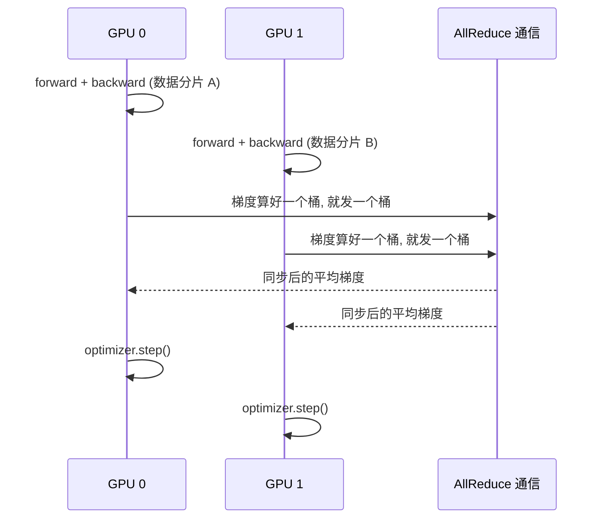
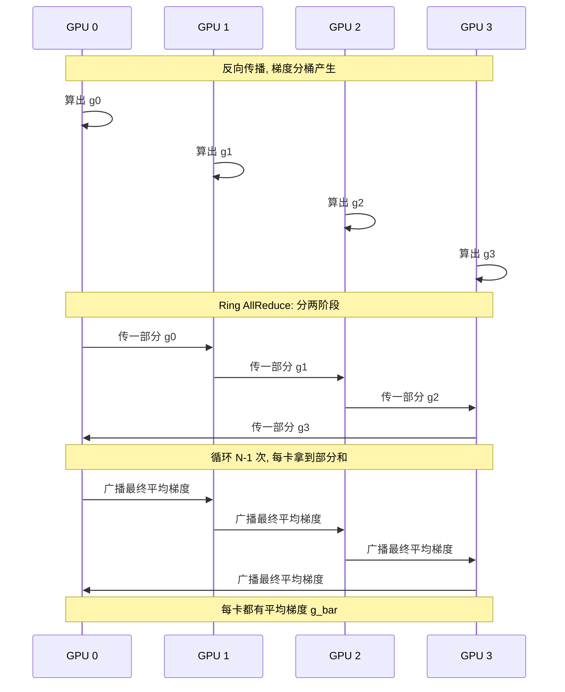

在[第 7 章](/blog/posts/gpu-util-07-memory-batch/)里,我们打通了单卡优化的最后一公里。util 从 75% 涨到了 92%,功耗从 260W 涨到了 320W,吞吐翻了 3 倍——**单卡已经接近满分了**。

<!-- more -->

但是,人的欲望是无穷的。当你看到 RTX 3090 已经跑到 92% 的时候,你脑子里一定会冒出一个念头:

> "如果我再买三张卡,是不是训练速度能直接翻 4 倍?"

答案是:**理论上可以,但前提是你得会用"多卡并行"。** 如果不会用,你可能不但没提速,反而比单卡还慢——因为多卡之间要"对账",对账的成本可能吃掉所有收益。

这一章,我们就来学习多卡并行的两把利器:**DDP** 和 **FSDP**。

---

## 8.1 先讲个"多人搬砖"的故事

想象你要盖一栋房子,单个人搬砖太慢。于是你雇了 **4 个工人**(4 张 GPU)。

现在问题来了:**怎么分工?**

### 方案 A:每个工人各盖一栋楼

每人独立盖一栋楼,互不干扰。听起来很爽——但问题是,你要的其实是**一栋楼**,不是四栋。而且,**四个人盖出来的楼可能不一样高、不一样宽**,最后拼不到一起。

**这就是"数据并行"要解决的问题**:大家要盖**同一栋楼**,只是**分工搬不同的砖**。

### 方案 B:每个工人搬一部分砖,定期对账

4 个工人**都盖同一栋楼**(每张卡都有一份完整的模型副本),但**各自负责不同的砖块**(每张卡吃不同的数据分片)。

每搬完一批砖,4 个人**碰头对一下账**:"你搬了多少?我搬了多少?咱们把总数平均一下,然后按平均后的方案继续搬。"

**这就是 DDP(Distributed Data Parallel,分布式数据并行)。**

**核心矛盾**:对账(通信)需要时间。工人碰头对账的时候,谁都没法搬砖。所以 DDP 的目标就是:**让对账和搬砖同时进行,让对账"不被察觉"。**

---

## 8.2 DDP:多卡并行的入门首选

### 核心思路

DDP 的思路非常直白:

- **每张卡放一份完整的模型副本**(所以显存要放得下单卡模型)。
- **每张卡吃不同的数据分片**(所以要用 `DistributedSampler` 分配数据)。
- **反向传播结束时,所有卡同步梯度**(用 AllReduce 取平均,保证每张卡的模型一致)。

用一句话总结:**多个工人各干一份活,最后对账,保证大家盖的是同一栋楼。**

### 一个 step 的内部流程



**关键点**:

1. 每张卡**独立**做 forward 和 backward。
2. 梯度**一算出来就按桶(bucket)分桶**,和反向计算**重叠**地做 AllReduce。
3. 优化器**各自**用同步后的梯度更新——因为梯度一样,更新后的权重也**保持一致**。

**第 2 点是最关键的**。如果等所有梯度都算完再同步,那反向计算和通信就是串行的,GPU 会空等。DDP 的做法是**边算边同步**,让通信"藏"在计算里。

---

## 8.3 怎么用 DDP:三行代码搞定

### 启动方式:用 torchrun

**新手最容易踩的坑**:在单进程里写 `for i in range(4): model_gpu[i]...`。

**这是反模式!** 正确做法是:**每张卡启动一个独立的进程**,用 `torchrun` 启动:

```bash
torchrun --nproc_per_node=4 train.py
```

逐行解释:

- `torchrun`:PyTorch 官方的多进程启动器。
- `--nproc_per_node=4`:每台机器启动 4 个进程(对应 4 张卡)。
- `train.py`:你的训练脚本。

**记住**:多卡是**多进程**,不是单进程里的 for 循环。这是新手最容易搞混的地方。

### 代码改动:包一层即可

PyTorch 的 DDP 封装得非常好,核心改动就三行:

```python
import torch.distributed as dist
from torch.nn.parallel import DistributedDataParallel as DDP

dist.init_process_group("nccl")   # 初始化通信后端
model = DDP(model.cuda())          # 把模型包一层
```

逐行解释:

- `init_process_group("nccl")`:初始化进程组。`nccl` 是 NVIDIA 的 GPU 通信库,多卡必备。
- `DDP(model.cuda())`:把模型包一层 DDP。之后 `model(x)` 就和单卡一样用,**但梯度会自动同步**。

### 数据分片:DistributedSampler

每张卡要吃**不同的数据**,否则就重复劳动了。这需要用 `DistributedSampler`:

```python
from torch.utils.data.distributed import DistributedSampler

sampler = DistributedSampler(ds, num_replicas=dist.get_world_size(),
                             rank=dist.get_rank())
loader = DataLoader(ds, batch_size=16, sampler=sampler, num_workers=8)
```

逐行解释:

- `num_replicas=dist.get_world_size()`:总共几张卡。
- `rank=dist.get_rank()`:我是第几张卡。
- `sampler=sampler`:告诉 DataLoader 用这个采样器,**每张卡自动拿到不重叠的数据分片**。

**别忘了每个 epoch 开始前调用 `sampler.set_epoch(epoch)`**,否则 shuffle 会失效。

---

## 8.4 DDP 的四个常见坑

DDP 用起来简单,但有几个坑新手几乎必踩。

### 坑一:忘了 DistributedSampler

如果不用 `DistributedSampler`,每张卡都会**吃完整数据集**,结果就是:

- 4 张卡跑出 4 倍的计算量,但**等效 batch 没变**。
- 训练速度不仅没提升,反而因为通信开销变慢了。

**正道**:永远记得用 `DistributedSampler`。

### 坑二:日志/checkpoint 重复打印

如果每张卡都 `print(loss)`,你会看到**4 份重复的日志**——而且每次打印都是一次同步(回忆[第 5 章](/blog/posts/gpu-util-05-sync-launch/))。

**正道**:**只在 rank 0 打印和存 checkpoint**:

```python
if dist.get_rank() == 0:
    print(f"step {step}, loss {loss.item()}")
    torch.save(model.state_dict(), "ckpt.pt")
```

### 坑三:worker 数打爆 CPU

如果你单卡用 `num_workers=8`,4 张卡就是 **32 个 worker**——CPU 直接被吃干。

**正道**:**每卡 worker 数 = 总 worker 预算 / 卡数**。比如你有 16 核,4 张卡,那每卡设 `num_workers=4` 就够了。

### 坑四:学习率没按卡数放大

DDP 下,**有效 batch = per_gpu_batch × world_size**。

比如单卡 batch=16,4 张卡就是**有效 batch=64**。如果你还用单卡的学习率,训练会**不稳定甚至发散**。

**正道**:学习率按卡数**线性放大**(或按平方根缩放,视情况而定)。

---

## 8.5 怎么判断通信成了瓶颈?

DDP 跑起来后,拍一次 Profiler 时间线(回忆[第 2 章](/blog/posts/gpu-util-02-profiler/)),你可能会看到这样一个典型的形状:

> **GPU util 呈"锯齿状"**:反向计算时 util 高,反向结束后**一段全空**——那是在等 AllReduce。

这就是**通信瓶颈**。修法有几个方向:

- **增大 bucket**:DDP 默认 bucket 是 25MB,调大能让重叠更充分。
- **梯度压缩**:用 fp16/bf16 做 AllReduce,通信量减半。
- **换拓扑**:卡间用 **NVLink** 而不是 PCIe,NVLink 带宽是 PCIe 的十几倍。
- **上重叠度更高的方案**:比如 FSDP 的通信可以和计算深度重叠。

**一句话诊断**:**锯齿状 = 通信等待**。锯齿越深,通信瓶颈越严重。

---

## 8.6 FSDP:当模型放不下单卡时

DDP 有一个硬性前提:**每张卡要放一份完整的模型 + 优化器状态**。

对于 10 亿参数的模型,这大概要 16GB(参数 4GB + 梯度 4GB + 优化器状态 8GB)。24GB 的 3090 勉强能塞下,但如果是 **100 亿参数**的模型呢?单卡直接 OOM。

**这时候就要请出 FSDP**。

### 核心思路

FSDP(Fully Sharded Data Parallel,完全分片数据并行)的思路是:

> **把参数、梯度、优化器状态都切片,分散到各张卡上。用到哪一片,就临时聚合过来。**

打个比方:

- **DDP**:每个工人**都有一本完整的食谱**(完整模型),照着食谱一起做菜。
- **FSDP**:**食谱被撕成 4 份**,每个工人只拿一份。做菜时,轮到哪一步,就把对应的那页**借过来看一眼**,看完立刻还回去。

**效果**:**显存随卡数近似线性下降**。4 张卡就能训 4 倍大的模型。

### 代价

天下没有免费的午餐。FSDP 的代价是:

- **通信量更大**:每次用到参数都要"借/还",通信比 DDP 多。
- **代码更复杂**:需要指定如何切分模型(用 `auto_wrap_policy`)。

### 怎么选 DDP 还是 FSDP?

给你一个简单的判断标准:

| 情况 | 选择 |
|------|------|
| 模型 + 状态能塞进单卡 | **DDP**(简单、快) |
| 模型 + 状态塞不下单卡 | **FSDP**(能训更大的模型) |

**新手建议**:先用 DDP。只有当 DDP 真的 OOM 了,再考虑上 FSDP。

### FSDP 的最小骨架

```python
from torch.distributed.fsdp import FullyShardedDataParallel as FSDP

model = FSDP(model.cuda())    # 一行包一层, 和 DDP 很像
```

看起来和 DDP 差不多,但 FSDP 内部做了**参数分片**。实际使用时,还需要配一个 `auto_wrap_policy`,告诉 FSDP **按什么粒度切分**(通常按 Transformer 层切),这里就不展开了。

---

## 8.7 多机与云上:带宽是稀缺资源

如果你不满足于单机 4 卡,想上**多机**(比如两台机器,每台 4 卡,总共 8 卡),那要记住一条铁律:

> **节点间带宽是稀缺资源。**

- **单机内**:卡间通信走 **NVLink**,带宽几百 GB/s。
- **跨机器**:走 **以太网 / InfiniBand**,通常只有 **25-100 GbE**(约 3-12 GB/s),**比 NVLink 低一个数量级**。

**这意味着**:跨机器的 AllReduce 会**非常慢**。所以多机训练要格外注意:

- **梯度分桶 + 压缩**:减少跨机通信量。
- **用 NCCL 的环状算法**:让通信走最短路径。
- **保持负载均衡**:数据长度不均时,按 token 数均衡采样,别让某张卡拖后腿。

**新手建议**:先在**单机多卡**上把 DDP 跑熟,再考虑多机。

---

## 8.8 内部机制:DDP 的 AllReduce 到底做了什么?

我们用一张时序图,看看 DDP 一次 AllReduce 的全过程。

假设 4 张卡,每张卡算出了自己的梯度 $g_0, g_1, g_2, g_3$,目标是**让每张卡都拿到平均梯度** $\bar{g} = (g_0 + g_1 + g_2 + g_3) / 4$。



**关键点**:

- **Ring AllReduce** 分两个阶段:**先算部分和,再广播结果**。
- 每个阶段只循环 N-1 次(N 是卡数),**通信量不随卡数增长**——这就是 Ring 算法的精妙之处。
- **整个通信过程与反向计算重叠**:梯度一算好就发出去,不用等全部算完。

**这就是为什么 DDP 的通信能"不被察觉"**——它把通信藏在了计算里。

---

## 8.9 深入一点点:为什么 DDP 要"分桶"?

你可能会问:为什么 DDP 不一次性把**所有梯度**都 AllReduce,而要**分桶**?

答案是:**为了重叠**。

- 如果等所有梯度算完再一次性 AllReduce,那反向计算和通信就是**串行**的——GPU 先算完所有梯度,然后空等通信。
- 分桶后,**第一个桶的梯度一算好就发出去**,通信和后续的反向计算**同时进行**。

**桶的大小是个权衡**:

- **桶太小**:通信次数多,每次都要握手,开销大。
- **桶太大**:重叠不充分,又变成串行。

DDP 默认 **25MB** 一个桶,这是个经验值。如果你发现通信瓶颈严重,可以试试调大它。

---

## 8.10 验收:多卡的成绩单

回到我们的案例。单卡已经跑到 92% util、320W 功耗。现在上 4 卡 DDP:

| 指标 | 单卡 | 4 卡 DDP |
|------|------|---------|
| 每步耗时 | 96ms | ~28ms |
| GPU-Util | 92% | 88% |
| 功耗 | 320W | 300W × 4 |
| 吞吐 | 1x | **~3.4x** |

**注意几件事**:

1. **吞吐不是 4 倍,而是 3.4 倍**。差的 0.6 倍就是**通信开销**——AllReduce 花掉的时间。
2. **util 略微下降**(92% → 88%)。因为通信时 GPU 在等,util 掉了一点。这是**正常的**。
3. **功耗略微下降**。因为 GPU 有时在等通信,出力少了。

**这就是多卡的真实情况**:理论上 N 倍,实际是 N 倍减去通信开销。**能到 3.4 倍已经是很不错的成绩了。**

---

## 8.11 本章小结

恭喜!你已经跨入了**多卡并行**的世界。回顾一下重点:

1. **单卡真满载后,只能横向扩展**。多卡的核心矛盾是**通信成本**,目标是让通信和计算重叠,不被察觉。
2. **DDP 的思路**:每卡放完整模型副本,各吃数据分片,反向时 AllReduce 同步梯度。
3. **DDP 三行代码**:`init_process_group` + `DDP(model)` + `DistributedSampler`。
4. **DDP 的四个坑**:
   - 忘了 `DistributedSampler` → 数据重复
   - 日志重复打印 → 只在 rank 0 打
   - worker 数打爆 CPU → 每卡 worker 数 = 总预算 / 卡数
   - 学习率没放大 → 按卡数线性放大
5. **通信瓶颈的诊断**:**时间线上 util 呈锯齿状**。修法:bucket 调大、梯度压缩、NVLink、FSDP。
6. **FSDP 的思路**:把参数/梯度/优化器状态切片分到各卡,显存随卡数近似线性下降。**塞得下单卡用 DDP,塞不下用 FSDP**。
7. **多机时,节点间带宽是稀缺资源**,要格外注意通信优化。

---

## 8.12 全系列回顾:从 35% 到多卡满载

让我们把整个系列的修复历程串起来,作为这个教程的收尾:

| 阶段 | util | 功耗 | 症结 |
|------|------|------|------|
| 初始 | 35% | 90W | 四病齐全 |
| 修数据流水线 | 55% | 150W | CPU 同步等待 |
| 修同步 + 图捕获 | 65% | 200W | kernel 太碎 |
| 修算子融合 | 75% | 260W | batch 偏小 |
| 修显存 + 加大 batch | 92% | 320W | 单卡接近满载 |
| **上 4 卡 DDP** | **88% × 4** | **300W × 4** | **吞吐 ~3.4 倍** |

**方法论一句话**:

> **测量 → 定位 → 单变量修复 → 复测,循环直到功耗和 util 同时贴上限。**

这就是整个系列的**核心心法**。无论你遇到什么性能问题,记住这个循环,你就能一步步逼近最优。

**最后一条军规**:优化目标是用**更少的时间**完成**同样的训练**,不是好看的 util 数字。别本末倒置。

祝你的 GPU 永远满载,训练飞快!

---

**全系列完**

➡️ 回到[第 1 章: GPU 利用率与功耗指标解读](/blog/posts/gpu-util-01-metrics/)

---

Generated by [AI Codebase Knowledge Builder](https://github.com/The-Pocket/Tutorial-Codebase-Knowledge)